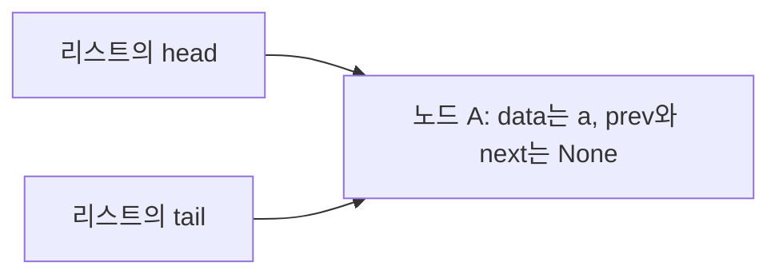

# B5-1 학습 정리 — CLI 기반 Mini Redis

이 문서는 [Subject.txt](Subject.txt)의 핵심 개념과 과제를 마친 뒤 스스로 설명할 수 있어야 할 내용을 정리한다. [Evaluate.txt](Evaluate.txt)의 설명·응용 질문도 학습 범위에 포함한다. `평가 2-1` 같은 표기는 평가 문항 번호다.

학습·구현 범위는 `Subject.txt`의 필수 요구사항과 `Evaluate.txt`의 평가 내용이다. 보너스 과제는 제외한다. 아래 예시와 설계 대안은 이해를 돕기 위한 것이며, 특정 대안을 필수 구현으로 추가하지 않는다. 구현 순서는 다음 단계의 `CHECK.md`에서 정하고, 코드 구현은 작은 클래스·함수 단위로 진행한다.

## 1. 이 과제를 통해 배울 것

**근거: Subject 1~4장, 평가 항목 1~4**

In-Memory Key-Value 저장소는 실행 중인 프로그램의 메모리에 키와 값을 보관한다. 이번 과제에서는 키로 문자열 값을 찾고, 메모리가 부족하면 사용 순서에 따라 데이터를 제거하고, 정해진 시간이 지나면 데이터를 만료시킨다.

| 핵심 키워드 | 과제와의 연결 | 마친 뒤 설명할 내용 |
| --- | --- | --- |
| 이중 연결 리스트, 노드 참조 | 최근 사용 순서 유지 | 어떤 연결을 바꾸기에 삽입·삭제·이동이 O(1)인가 |
| 해시 함수, 버킷, 체이닝 | 키로 데이터 조회 | 문자열이 인덱스로 바뀌는 과정과 충돌 처리 |
| 로드 팩터, 재해싱 | 해시맵 확장 | 0.75 초과 시 버킷을 2배로 늘리고 재배치하는 이유 |
| LRU, MRU | 메모리 초과 시 제거 대상 결정 | 해시맵과 연결 리스트를 함께 사용하는 이유 |
| 최소 힙, 완전 이진 트리 | 가장 빠른 만료 조회 | 최소값을 빠르게 찾고 갱신하는 원리 |
| TTL, 만료 시각, 지연 삭제 | `EXPIRE`, `TTL` | 만료 확인과 오래된 만료 기록 처리 |
| UTF-8, 바이트, 메모리 집계 | `INFO memory`, 메모리 제한 | 저장·덮어쓰기·삭제 시 사용량 변화 |
| REPL, 파싱, 입력 검증 | CLI 명령 처리 | 입력을 명령과 인자로 나누고 결과를 출력하는 흐름 |
| LFU, 병목, 오버헤드 | 평가의 응용 질문 | 조건이 바뀌면 자료구조와 비용이 어떻게 달라지는가 |

## 2. 구현 범위와 제약

**근거: Subject 2장, 4장, 6~7장**

- Python 3.8 이상에서 실행하는 CLI 프로그램이다.
- 기본 명령 6개, 메모리 관리 명령 2개, TTL 관리 명령 2개를 구현한다.
- 이중 연결 리스트·해시맵·최소 힙을 직접 구현하고, 각각 독립된 모듈/파일로 분리한다.
- 핵심 클래스와 함수에는 주석 또는 docstring을 작성한다.
- `dict`, `set`, `collections`를 사용하지 않는다. TTL 정보나 LRU 보조 조회도 이 제한을 따라야 한다.
- 고정 길이 배열과 인덱스 접근 수준의 저장소는 제한적으로 선택할 수 있다. 배열 저장소를 이용하는 것과 내장 컬렉션으로 해시맵·캐시를 대신하는 것은 구분한다.
- 힙도 직접 구현 대상이다. 기존 힙 API 호출만으로 `push`, `pop`, heapify 구현을 대신하면 직접 구현 요구를 충족하지 않는다.
- 네트워크 통신, 파일 영속성, Redis의 List/Set/Sorted Set은 구현하지 않는다. 멀티스레딩과 락은 요구하지 않는다.

이 과제의 완료 기준은 명세에 적힌 Mini Redis다. 실제 Redis의 모든 옵션이나 내부 구현을 재현할 필요는 없다. 또한 다른 과제에서 허용했던 내장 자료형이나 요구했던 제출물을 이번 과제에 그대로 적용하지 않는다.

## 3. 시간복잡도를 읽는 기준

**근거: Subject 3장, 4장 「기본 자료구조 직접 구현」, 평가 2-1·3-2·4-2**

`n`은 저장된 키 수, `b`는 해시맵 버킷 수, `h`는 힙에 남아 있는 기록 수로 둔다. 지연 삭제를 선택하면 `h`와 현재 TTL이 설정된 키 수는 다를 수 있다.

| 표기 | 의미 | 이번 과제의 예 |
| --- | --- | --- |
| O(1) | 데이터 개수에 비례해 작업량이 증가하지 않음 | 위치를 아는 노드의 연결 변경, 힙의 맨 위 조회 |
| O(log h) | 힙의 높이 정도만 따라감 | 최소 힙의 위·아래 정렬 복구 |
| O(n) | 키 개수에 비례해 작업량이 증가함 | 모든 키를 결과로 나열하기 |
| O(n + b) | 원소와 버킷을 모두 살펴봄 | 체이닝 해시맵 전체 순회 |

**평균·최악·분할 상환을 구분한다.** 해시가 고르게 분산되고 로드 팩터가 관리되면 키 조회는 평균 O(1)이지만, 한 버킷에 몰리면 최악 O(n)이다. 확장이 일어나는 한 번의 삽입에는 재배치 비용이 추가된다. 여러 연산에 걸쳐 확장 비용을 나누어 보는 것이 분할 상환 분석이다.

문자열 길이도 비용에 영향을 준다. 길이 `k`인 키를 끝까지 읽는 해시 함수는 O(k)다. “평균 O(1) 조회”는 흔히 키 길이를 일정하다고 놓고 키 개수에 대한 비용을 설명한 표현이다.

**스스로 설명해 보기:** LRU 노드 이동이 O(1)이라는 사실만으로 `GET` 명령 전체가 항상 O(1)이라고 말할 수 있는가?

## 4. 이중 연결 리스트

**근거: Subject 4장 「이중 연결 리스트」, 평가 2-1**

노드는 데이터를 담고 다른 노드를 참조하는 단위다. `prev`는 이전 노드, `next`는 다음 노드, `data`는 저장할 내용이다. 참조는 옆 노드를 복사한 값이 아니라 그 노드에 접근하기 위한 연결이다.

예를 들어 `A ↔ B ↔ C`에서 B를 제거할 때는 A와 C가 서로 연결되도록 바꾼다. B의 위치를 이미 알고 있다면 리스트 전체를 순회할 필요가 없다.

| 필수 메서드 | 역할 | O(1)을 위한 핵심 |
| --- | --- | --- |
| `insert_front` | 맨 앞에 삽입 | 앞쪽 경계의 연결만 변경 |
| `insert_back` | 맨 뒤에 삽입 | 뒤쪽 경계의 연결만 변경 |
| `remove_front` | 맨 앞 노드 제거 | 앞 노드를 바로 알 수 있음 |
| `remove_back` | 맨 뒤 노드 제거 | 뒤 노드를 바로 알 수 있음 |
| `remove_node` | 지정한 노드 제거 | 대상 노드의 참조를 이미 가지고 있음 |
| `move_to_front` | 지정한 노드를 맨 앞으로 이동 | 연결을 끊고 앞에 다시 연결 |

`remove_node`가 데이터 값으로 대상을 처음부터 검색하면 그 검색은 O(n)이다. **노드를 찾는 작업과 노드의 연결을 바꾸는 작업을 분리해서** 설명해야 한다.

빈 리스트, 노드 한 개, 맨 앞·맨 뒤·중간 노드의 경우에도 양방향 연결이 맞아야 한다. 실제 첫·끝 노드를 직접 관리할지, 경계 처리를 돕는 더미 노드인 센티널을 둘지는 설계 선택이다.

**스스로 설명해 보기:** 노드가 한 개일 때 `remove_back`을 실행하면 앞쪽과 뒤쪽 상태는 각각 어떻게 되어야 하는가?

### 첫 구현 단위: 노드와 빈 리스트의 상태

이번 구현에서는 센티널 없이 `head`가 실제 첫 노드, `tail`이 실제 마지막 노드를 가리키는 방식을 사용한다. 명세가 허용하는 구현 선택이며, `CHECK.md`의 D1에 기록한다. 두 끝의 참조를 보관하면 앞이나 뒤에 접근할 때 전체 노드를 탐색할 필요가 없다.

`Node`는 데이터 하나와 이웃 노드의 연결을 관리하고, `DoublyLinkedList`는 리스트 전체의 양 끝을 관리한다. 첫 구현 단위의 대상은 두 클래스의 생성자이며, 삽입·삭제는 이후 단위에서 다룬다.

| 생성한 대상 | 속성 | 초기 상태 |
| --- | --- | --- |
| `Node("a")` | `data` | 전달받은 문자열 `"a"` |
| `Node("a")` | `prev`, `next` | 아직 이웃이 없으므로 각각 `None` |
| 빈 `DoublyLinkedList()` | `head`, `tail` | 아직 노드가 없으므로 각각 `None` |

노드의 `data: object`는 저장할 내용을 문자열로 한정하지 않기 위한 타입 표기다. 이후 해시맵의 엔트리 등도 담을 수 있도록 전달받은 객체를 그대로 보관한다. 여기에서 문자열 변환이나 복사는 필요하지 않다.

노드 하나가 리스트에 들어가면 `head`와 `tail`은 **동일한 노드 객체**를 가리킨다. 같은 값을 가진 노드 두 개를 따로 만드는 의미가 아니다. 첫 단위에서는 노드 생성과 빈 리스트 생성까지 구현하고, 이 연결은 삽입 단계에서 만든다.

**구현 후 확인할 상태:** `Node("a")`와 `Node("b")`를 각각 만들었을 때 데이터가 구분되고 각 노드의 양쪽 참조는 비어 있어야 한다. 별도로 생성한 빈 리스트의 양 끝도 비어 있어야 한다.

### 앞쪽 삽입: insert_front

**대응: CHECK 1-1의 `insert_front` / 근거: Subject 4장 「이중 연결 리스트」**

이번 메서드의 형태는 `insert_front(self, data: object) -> Node`다. 데이터를 받아 새 노드를 만들고 맨 앞에 연결한 뒤, **실제로 삽입한 노드 객체**를 반환한다. 반환값을 노드로 정한 것은 내부 API의 설계 선택이다. 이후 LRU 추적에서 같은 노드에 직접 접근할 수 있도록 참조를 보관하는 데 사용한다.

#### 입력 데이터와 노드 객체를 구분하기

`linked.insert_front("a")`를 호출했다고 생각해 보자. 메서드 안의 `self`는 `linked`라는 리스트 객체이고, `data`는 전달받은 문자열 `"a"`다. `data: object`라는 타입 표기가 입력을 자동으로 `Node`로 바꾸지는 않는다.

앞서 구현한 `Node` 생성자는 전달받은 데이터를 보관하고, `prev`·`next`를 `None`으로 초기화한다. 따라서 데이터에서 노드를 만드는 일은 그 생성자를 호출하는 일이다. 아래는 이 차이를 확인하기 위한 작은 예시이며, `insert_front`의 완성 코드가 아니다.

```python
value = "a"
node = Node(value)
```

| 표현 | 실제로 가리키는 것 | 역할 |
| --- | --- | --- |
| `value` | 문자열 `"a"` | 저장할 내용 |
| `node` | 새 `Node` 객체 하나 | 내용과 앞뒤 연결을 함께 보관 |
| `node.data` | 문자열 `"a"` | 노드 안의 내용 |
| `node.prev` | `None` | 아직 이전 노드 없음 |
| `node.next` | `None` | 아직 다음 노드 없음 |

문자열 `"a"` 자체에는 노드의 `prev`·`next` 속성이 없다. 그래서 `head`에 문자열을 바로 저장하면 나중에 `head.next`로 다음 노드를 찾을 수 없다. `head`와 `tail`에는 **노드 객체의 참조**를 저장해야 한다.

#### 빈 리스트에 첫 노드를 넣는 경우

처음에는 `head`와 `tail`이 모두 `None`이다. 이때 새 노드 A 하나를 넣으면 A가 첫 노드이면서 동시에 마지막 노드가 된다.



두 화살표는 같은 노드 하나를 가리킨다. `head`용 노드와 `tail`용 노드를 각각 만드는 것이 아니다. 또한 두 참조를 같은 노드로 지정한다고 그 노드의 `prev`·`next`가 자동으로 자신을 가리키게 되는 것도 아니다. 리스트의 양 끝 정보와 노드 내부 연결은 서로 다른 속성이다.

빈 상태에서는 연결할 이웃이 없으므로 새 노드의 `prev`·`next`는 생성자가 설정한 `None`을 유지한다. 우선 **새 노드 생성 → 리스트의 양 끝에서 그 노드를 참조 → 삽입한 노드 반환**이라는 흐름을 코드로 옮긴다.

함수 선언의 `-> Node`는 기대하는 반환 타입을 나타낸다. 자동으로 노드를 반환해 주지는 않으며, 실제 `return` 없이 함수 끝에 도달하면 Python은 `None`을 반환한다. 반환한 노드를 호출자가 보관할 수 있어야 이후 그 노드를 검색 없이 직접 이동하거나 삭제할 수 있다.

#### 기존 노드가 있는 경우와 비교하기

빈 리스트와 이미 노드가 있는 리스트를 구분해서 생각한다. X는 이번에 생성한 노드, A·B는 기존 노드다. 아래 표는 대입 순서가 아니라 **삽입을 마친 뒤의 상태**다.

| 확인할 대상 | 빈 리스트에 X 삽입 | `A ↔ B` 앞에 X 삽입 |
| --- | --- | --- |
| 전체 연결 | X 하나 | `X ↔ A ↔ B` |
| `head` | X | X |
| `tail` | X | 기존 B 유지 |
| X의 `prev` | `None` | `None` |
| X의 `next` | `None` | A |
| 기존 첫 노드의 `prev` | 기존 노드 없음 | A의 `prev`가 X를 가리킴 |
| 반환값 | X 객체 | X 객체 |

기존 노드가 A 하나뿐이었다면 삽입 후 `X ↔ A`가 되고 `tail`은 A를 유지한다. `next`뿐 아니라 반대 방향의 `prev`도 연결되어야 이중 연결 리스트가 된다.

연결을 바꾸는 동안 기존 첫 노드를 계속 참조할 수 있어야 한다. `head`를 새 노드로 바꾼 뒤에는 `self.head`가 무엇을 가리키는지 달라지므로, 대입 순서를 생각해 본다. 실수로 새 노드가 자신을 가리키게 연결하지 않도록 한다.

삽입 위치는 이미 `head`로 알고 있다. 노드 수와 관계없이 새 노드 생성과 몇 개의 참조 변경으로 끝나야 O(1)이며, 전체 리스트를 순회할 필요가 없다.

**구현 후 확인할 상태:** 빈 리스트에 `"a"`, `"b"`, `"c"`를 차례로 앞쪽 삽입하면 순방향은 `c → b → a`, 역방향은 `a → b → c`다. 양 끝 바깥의 참조는 `None`이어야 하고, 매번 반환한 객체는 그 호출에서 삽입한 노드여야 한다. 같은 데이터를 두 번 삽입해도 노드는 각각 새로 생성한다.

## 5. 해시맵, 체이닝, 재해싱

**근거: Subject 4장 「해시맵」, 평가 2-2~2-4**

### 키에서 버킷까지

해시맵은 키로 저장된 값을 찾는 자료구조다. 바깥에는 버킷 배열이 있고, 각 버킷에는 그 위치에 배정된 엔트리들이 있다. 엔트리 하나에는 키와 그 키에 연결된 값이 들어간다.

문자열 키를 직접 설계한 해시 함수로 정수에 대응시키고, 버킷 수로 나눈 나머지 등을 이용해 인덱스를 만든다. 예를 들어 `index = hash_value % b`라면 결과는 0부터 `b - 1` 사이에 있다. 어떤 문자를 어떤 순서로 반영하는지는 구현 단계에서 정한다.

단순히 문자 코드의 합만 이용하면 `ab`와 `ba`가 같은 결과를 만든다. 이는 해시 함수의 분산을 생각하기 위한 예시이며, 특정 해시 공식을 선택한 것은 아니다. 내장 `hash()` 호출만으로는 해시 함수를 직접 설계한 과정을 설명할 수 없다.

### 충돌과 덮어쓰기는 다르다

| 상황 | 뜻 | 처리의 핵심 |
| --- | --- | --- |
| 다른 키가 같은 버킷에 배정됨 | 해시 충돌 | 두 엔트리를 함께 보관하고 실제 키를 비교 |
| 이미 저장된 키를 다시 `put`함 | 기존 값 갱신 | 같은 키의 값을 바꾸고 키 수는 유지 |

체이닝은 한 버킷에 여러 엔트리를 연결해 보관하는 충돌 해결 방식이다. 명세는 이중 연결 리스트 재사용을 권장하지만, 이를 유일한 방법으로 강제하지는 않는다.

리스트 **구현을 재사용**하는 것과 동일한 **노드 객체를 공유**하는 것은 다르다. 하나의 `prev`·`next` 쌍으로 버킷 순서와 LRU 순서를 동시에 표현할 수는 없다. 두 순서가 다를 수 있기 때문이다.

필수 메서드는 `put`, `get`, `remove`, `contains`, `keys`, `size`다. `get`과 `contains`는 키가 같은지 확인해야 하고, `size`는 사용 중인 버킷 수가 아니라 저장된 키 수다.

### 로드 팩터와 버킷 확장

로드 팩터는 `n / b`, 즉 버킷 하나당 평균 엔트리 수다. **0.75를 초과하면** 버킷 수를 2배로 늘려야 한다.

| 버킷 수 | 키 수 | 로드 팩터 | 요구되는 판단 |
| --- | --- | --- | --- |
| 8 | 6 | 0.75 | 아직 임계값을 초과하지 않음 |
| 8 | 7 | 0.875 | 16개 버킷으로 확장 |
| 16 | 7 | 0.4375 | 확장 후 상태 |

확장은 빈 칸을 뒤에 붙이는 것으로 끝나지 않는다. 버킷 수가 달라졌으므로 기존 키들도 새 버킷 수를 기준으로 인덱스를 다시 계산하고 배치해야 한다. 이것을 재해싱이라고 한다. 이때 키를 잃거나 복제하거나, 키 수를 두 번 세면 안 된다.

**스스로 설명해 보기:** 키 수 6개, 버킷 수 8개인 상태에서 기존 키의 값만 바꾸면 로드 팩터는 어떻게 되는가? 확장 후 예전 위치에서만 키를 찾으면 왜 실패할 수 있는가?

## 6. 최소 힙과 만료 순서

**근거: Subject 4장 「힙」 및 「TTL 관리」, 평가 3-3**

최소 힙은 각 부모의 우선순위가 자식의 우선순위보다 크지 않도록 유지하는 자료구조다. 루트에 최소값이 오지만, 배열 전체가 정렬되어 있는 것은 아니다.

완전 이진 트리는 마지막 층을 제외한 층이 채워져 있고 마지막 층도 왼쪽부터 채워진 형태다. 배열의 인덱스를 0부터 사용하면 노드 `i`의 부모는 `(i - 1) // 2`이며, 자식은 `2 * i + 1`, `2 * i + 2`다. 루트에는 부모가 없고 자식 인덱스가 원소 수 이상이면 그 자식은 없다.

| 필수 메서드 | 이해할 동작 | 힙 정렬 유지 비용 |
| --- | --- | --- |
| `push` | 끝에 추가한 원소를 부모와 비교해 올림 | O(log h) |
| `_heapify_up` | 부모와의 순서 위반을 위쪽으로 복구 | O(log h) |
| `pop` | 최소값을 꺼내고 마지막 원소를 루트로 옮겨 복구 | O(log h) |
| `_heapify_down` | 더 작은 자식 쪽으로 순서 위반을 복구 | O(log h) |
| `peek` | 최소값을 제거하지 않고 확인 | O(1) |
| `size` | 저장된 원소 수 확인 | 개수를 보관한다면 O(1) |

위 표의 비용은 힙 순서를 유지하는 비용이다. 내부 배열 확장 시 복사 비용은 별도로 생각한다. 빈 힙의 반환값이나 예외 방식은 명세에 고정되어 있지 않다.

TTL 기록은 `(expire_at, key)` 형태를 다룰 수 있어야 한다. 예를 들어 `(100, "a")`, `(80, "b")`, `(120, "c")`에서 먼저 확인할 만료 후보는 시각 80의 b다. 힙의 맨 위가 아직 만료되지 않았다면, 그보다 늦은 나머지 기록도 아직 만료되지 않았다.

**스스로 설명해 보기:** 최소 힙이 “가장 빨리 만료될 키”를 찾는 데 적합하지만, “특정 키의 기록”을 바로 찾는 데는 별도의 고려가 필요한 이유는 무엇인가?

## 7. LRU와 해시맵·리스트의 조합

**근거: Subject 2~4장 「LRU」, 평가 1-2·3-1·3-2**

LRU(Least Recently Used)는 가장 오래 사용되지 않은 키를 먼저 제거하는 정책이다. MRU(Most Recently Used)는 가장 최근에 사용한 키를 뜻한다. 삽입 시각과 마지막 사용 시각은 다를 수 있다.

해시맵은 키로 해당 데이터와 LRU 노드에 접근하는 역할을 맡고, 이중 연결 리스트는 사용 순서를 유지한다. 노드를 찾은 다음 리스트를 다시 검색하지 않고 그 노드를 이동해야 평균 O(1) LRU 갱신을 설명할 수 있다.

아래는 **앞쪽을 MRU, 뒤쪽을 LRU로 두었다고 가정한 예시**다. 앞뒤의 의미를 반대로 정해도 일관되게 동작하면 된다.

| 성공한 명령 | 최근 사용 → 오래된 사용 | 이유 |
| --- | --- | --- |
| `SET a A` | a | a를 저장함 |
| `SET b B` | b → a | b를 더 최근에 사용함 |
| `GET a` | a → b | 조회 성공으로 a가 최신이 됨 |
| `SET c C` | c → a → b | 이때 제한을 초과하면 b부터 제거 |

명세가 LRU 갱신을 요구하는 것은 성공한 `SET`과 `GET`이다. 없는 키나 만료된 키의 `GET`은 갱신하지 않는다. 다른 명령까지 LRU 갱신 대상으로 확대하는 것은 원문에 없는 동작을 추가하는 일이므로 별도 요구로 간주하지 않는다.

**스스로 설명해 보기:** 해시맵만 있으면 최근 사용 순서를 어떻게 알 수 있는가? 연결 리스트만 있으면 임의의 키를 찾는 데 얼마나 걸리는가?

## 8. 메모리 산정과 자동 제거

**근거: Subject 4장 「메모리 관리 + LRU 자동 제거」, 평가 1-2·1-3·3-4**

### 문자 수와 바이트 수

이번 과제의 메모리 사용량은 다음 공식으로 정해진다.

```text
엔트리 크기 = 키를 UTF-8로 인코딩한 바이트 수 + 값을 UTF-8로 인코딩한 바이트 수
used_memory = 현재 저장된 모든 엔트리 크기의 합
```

`len("가")`는 문자 수인 1이고, `len("가".encode("utf-8"))`는 바이트 수인 3이다. 키가 `a`, 값이 `가`이면 엔트리 크기는 4바이트다. 입력의 구분용 큰따옴표는 저장할 값 자체와 구분한다.

노드·참조·버킷·TTL 기록의 오버헤드는 이 공식에 포함하지 않는다. 따라서 `used_memory`는 과제에서 정의한 집계값이며, 운영체제가 측정하는 Python 프로세스의 실제 메모리 사용량과 같지 않다.

| 변경 | `used_memory`의 변화 |
| --- | --- |
| 새 키 저장 | 새 엔트리의 크기만큼 증가 |
| 기존 값 덮어쓰기 | 기존 엔트리 크기를 빼고 새 엔트리 크기를 더함 |
| `DEL`, TTL 만료, LRU 제거 | 실제 삭제된 엔트리 크기만큼 감소 |
| 같은 키의 TTL만 변경 | 변화 없음 |

없는 키를 삭제하거나 이미 처리한 만료 기록을 다시 정리하면서 사용량을 중복 차감하면 안 된다.

### 메모리 초과 처리 흐름

`maxmemory`는 0 이상의 정수이고, **0은 무제한**이다. 제한이 양수일 때 다음 관계를 이해해야 한다.

1. 저장하려는 키와 값 하나의 바이트 크기를 확인한다.
2. 그 단일 엔트리 자체가 제한보다 크면 저장하지 않고 OOM 에러를 낸다. 다른 키를 제거해도 이 엔트리를 담을 수는 없다.
3. 저장 가능한 `SET`은 새 저장 또는 덮어쓰기를 반영하고, TTL 초기화·LRU 갱신·메모리 집계를 맞춘다.
4. 저장 후 합계가 제한보다 크면 LRU 키부터 제거한다.
5. 제거할 때마다 관련 상태와 사용량을 갱신하고 `evicted_keys`를 1 증가시킨다. 제한 이하가 될 때까지 반복한다.

이는 요구되는 결과를 이해하기 위한 흐름이다. 실제 내부 함수 구성과 변경 순서는 구현 단계에서 정한다. `evicted_keys`는 메모리 제한 때문에 제거한 키의 누적 수이며, 일반 `DEL`이나 TTL 만료 횟수를 섞지 않는다.

원문의 예시에서는 `user:1`/`Alice`가 11바이트, `user:2`/`Bob`이 9바이트, `user:3`/`Charlie`가 13바이트다. 합계 33에서 LRU인 첫 엔트리의 11을 빼면 22가 되어 제한 30을 만족한다.

**스스로 설명해 보기:** 기존 값보다 짧은 값으로 덮어쓸 때 사용량은 어떻게 변하는가? 한 번의 `SET`으로 여러 키가 제거될 수 있는가?

## 9. TTL, 만료 시각, 지연 삭제

**근거: Subject 4장 「TTL 관리」 및 「TTL/LRU 엣지 케이스」, 평가 1-4·3-3**

TTL(Time To Live)은 남아 있는 유효 시간이다. `EXPIRE key seconds`는 현재 시각에 seconds를 더한 만료 시각 `expire_at`으로 이해할 수 있다. 현재 시각이 그 시각에 도달하거나 지나면 만료된 것이다.

| 키의 상태 | `TTL key` 결과 |
| --- | --- |
| 없거나 이미 만료됨 | `(integer) -2` |
| 존재하지만 만료 시각이 없음 | `(integer) -1` |
| 존재하고 만료 시각이 미래임 | 남은 초를 `(integer) N`으로 출력 |

남은 시간의 소수 부분을 정수 초로 바꾸는 구체적인 반올림 규칙은 명세에 고정되어 있지 않다. 원문의 `EXPIRE ... 3` 직후 `TTL`이 2인 예시는 실행 지연과 소수 부분 버림 등으로 설명할 수 있으며, 모든 실행에서 반드시 2가 나와야 한다는 뜻은 아니다.

`EXPIRE`는 없는 키에 0, 정상 설정 시 1을 반환한다. 0 이하의 seconds는 즉시 만료로 처리해도 된다고 명시되어 있다. 그 방식을 선택하면 존재하는 키를 삭제하고 1을 반환한다.

### 키 확인과 만료 후보 찾기

특정 키를 다루는 명령은 그 키가 만료되었는지 먼저 확인한다. 최소 힙은 여러 키 중 가장 이른 만료 후보를 찾는 데 사용한다. 이 두 역할이 함께 필요하다.

최소 힙을 보관하는 것만으로 시간이 지났을 때 코드가 자동 실행되지는 않는다. 명령 처리 시점 등 언제 만료 정리를 수행할지는 설계해야 한다. 백그라운드 스레드를 추가하라는 요구는 없다.

### 오래된 TTL 기록은 현재 상태와 다를 수 있다

예를 들어 a의 만료 시각을 100으로 설정한 뒤, 만료 전에 200으로 다시 설정했다고 하자. 힙에서 100의 기록을 꺼냈다는 이유만으로 현재의 a를 삭제하면 안 된다.

원문이 허용하는 선택 중 하나가 **지연 삭제(lazy deletion)**다. 현재 유효한 TTL 정보와 힙에서 나온 기록을 대조하여, 오래되어 효력을 잃은 기록은 버리는 방식이다. `SET`의 TTL 초기화, `DEL` 후 같은 키 재생성, LRU 제거 후 재생성에서도 과거 기록이 현재 데이터를 잘못 삭제하지 않도록 해야 한다.

`DEL`의 “모든 구조에서 제거”와 지연 삭제 허용은 함께 읽어야 한다. 지연 삭제를 선택하면 TTL의 효력은 즉시 없애고, 힙에 남은 무효 기록은 나중에 정리할 수 있다. 단지 힙에 남겨 놓고 유효 여부를 확인하지 않는 것은 지연 삭제를 올바르게 구현한 것이 아니다. 즉시 물리적으로 제거하는 방법도 가능하며, 어느 쪽인지는 아직 정하지 않는다.

**스스로 설명해 보기:** TTL이 있던 키를 `SET`으로 덮어쓴 뒤 예전 만료 시각이 지나면, 새 값이 삭제되면 안 되는 이유는 무엇인가?

## 10. 여러 자료구조의 상태 일치와 GET 흐름

**근거: Subject 4장 공통 규칙 및 TTL/LRU 엣지 케이스, 평가 3-4·3-5**

같은 키를 데이터 저장소, LRU 순서, TTL 정보에서 서로 다른 목적으로 참조한다. 한 곳만 바뀌면 실제 데이터와 관리 정보가 어긋날 수 있다. 이처럼 연산 전후에 유지되어야 할 관계를 불변 조건이라고 한다.

| 사건 | 데이터 | LRU | TTL | 사용량 / 제거 누적 수 |
| --- | --- | --- | --- | --- |
| 새 키의 `SET` 성공 | 추가 | 최근 사용으로 등록 | 없음 | 크기 증가 / 이후 LRU 제거 시 증가 |
| 기존 키의 `SET` 성공 | 값 교체 | 최근 사용으로 이동 | 기존 설정 삭제 | 크기 차이 반영 / 이후 LRU 제거 시 증가 |
| 유효한 키의 `GET` | 유지 | 최근 사용으로 이동 | 유지 | 변화 없음 |
| `DEL` 성공 | 제거 | 제거 | 제거 또는 무효화 | 크기 감소 / 증가 안 함 |
| TTL 만료 처리 | 제거 | 제거 | 제거 또는 무효화 | 크기 감소 / 증가 안 함 |
| LRU 자동 제거 | 제거 | 제거 | 제거 또는 무효화 | 크기 감소 / 1 증가 |

`GET`은 다음 순서와 조건을 설명할 수 있어야 한다.

1. 키의 존재와 만료 상태를 확인한다.
2. 만료되었으면 데이터·LRU·TTL 상태를 정리하고 사용량을 줄인다.
3. 없거나 만료된 키는 `(nil)`을 결과로 삼고 LRU를 갱신하지 않는다.
4. 유효한 키만 값 반환 대상이 되며, 조회 성공에 따른 LRU 갱신을 수행한다.

평가의 “값 반환 → LRU 갱신 조건”은 성공한 조회만 갱신한다는 관계를 설명하는 것이다. Python 함수에서 실제 `return` 뒤에 갱신 코드를 놓으면 실행되지 않는다. 반환 대상 결정, 내부 상태 갱신, 호출자에게 반환하는 시점을 구분한다.

**스스로 설명해 보기:** 만료된 키를 먼저 MRU로 옮겨 놓고 나중에 만료 여부를 확인하면 원문의 어느 규칙을 어기는가?

## 11. 명령어와 Redis 스타일 출력

**근거: Subject 2장 및 4장, 평가 1-1~1-5**

| 명령 | 알아야 할 결과와 규칙 |
| --- | --- |
| `SET key value` | 성공 시 `OK`, 덮어쓰기 시 TTL 초기화, LRU 갱신 및 메모리 제한 처리 |
| `GET key` | 유효하면 `"value"`, 없거나 만료되었으면 `(nil)` |
| `DEL key` | 삭제 성공 시 `(integer) 1`, 없으면 `(integer) 0` |
| `EXISTS key` | 존재하면 `(integer) 1`, 없거나 만료되었으면 `(integer) 0` |
| `DBSIZE` | 현재 저장된 키 수를 `(integer) N`으로 출력 |
| `KEYS` | 전체 키 목록을 배열 형태로 출력, 순서·정렬·패턴 매칭 요구 없음 |
| `CONFIG SET maxmemory bytes` | 0 이상의 정수, 0은 무제한, 성공 시 `OK` |
| `INFO memory` | `used_memory`, `maxmemory`, `evicted_keys`의 이름과 값 포함 |
| `EXPIRE key seconds` | 없으면 `(integer) 0`, 정상 설정 시 `(integer) 1` |
| `TTL key` | 없으면 -2, 만료 설정 없으면 -1, 나머지는 남은 초를 정수 형식으로 출력 |

`KEYS`가 비어 있으면 `(empty array)` 같은 표현을 사용할 수 있다. 표시 순서가 자유이므로 정렬 기능을 추가할 필요는 없다.

### REPL과 파싱

REPL은 입력을 읽고(Read), 명령을 실행하고(Evaluate), 결과를 출력하는(Print) 일을 반복하는(Loop) 구조다. 프롬프트는 `mini-redis>`이고, `exit` 또는 `quit`으로 종료할 수 있어야 한다.

파싱은 입력 문자열을 명령어와 인자로 나누는 일이다. 인자 개수 확인, 정수 변환, 값 범위 검사는 서로 구분한다. 예를 들어 `abc`는 정수 변환에 실패하지만 `-1`은 정수이면서 `maxmemory`의 허용 범위를 벗어난다.

값 파싱의 최소 요구는 공백 없는 값 또는 큰따옴표로 감싼 값 중 한 방식의 지원이다. 원문에는 따옴표 입력 예시도 있으므로 실제로 지원할 범위를 구현 단계에서 명확히 정한다. 복잡한 이스케이프나 모든 셸 문법까지 구현하라는 요구는 없다.

### 에러 형식

| 상황 | 원문에 제시된 형식 |
| --- | --- |
| 잘못된 명령 | `(error) ERR unknown command '<cmd>'` |
| 인자 개수 오류 | `(error) ERR wrong number of arguments for '<cmd>' command` |
| 정수 파싱 실패 | `(error) ERR value is not an integer or out of range` |
| 단일 엔트리의 메모리 제한 초과 | `(error) OOM command not allowed when used_memory > 'maxmemory'` |

내부 함수가 반환하는 값과 CLI가 출력하는 문자열은 구분한다. 예를 들어 내부의 정수 1을 사용자에게는 `(integer) 1`로 표시한다. 구체적인 예외 클래스나 반환 타입은 구현 단계의 선택이다.

**스스로 설명해 보기:** `GET`, `HELLO`, `CONFIG SET maxmemory abc`는 각각 어떤 검증 단계에서 구분해야 하는가?

## 12. 평가에서 추가로 설명할 내용

다음 세 주제는 **필수 학습 범위**다. 평가가 가정으로 묻는 조건 변경이므로, 현재 프로그램에 해당 기능을 추가하라는 요구로 바꾸지는 않는다.

### 12.1. LRU 대신 LFU를 사용한다면 — 평가 4-1

LFU(Least Frequently Used)는 사용 횟수가 가장 적은 키를 먼저 제거한다. LRU의 기준인 “언제 마지막으로 사용했는가”와 다르다. 많이 사용했지만 한동안 접근하지 않은 키와, 한 번만 사용했지만 방금 접근한 키를 생각하면 두 정책의 차이를 설명할 수 있다.

단순한 접근은 키마다 사용 횟수를 두고 제거할 때 전체를 훑어 최소 횟수를 찾는 것이다. 구조는 비교적 단순하지만 제거 대상 탐색에 O(n)이 든다.

평균 O(1) 갱신과 제거를 목표로 한다면, 한 가지 설계는 키별 횟수·노드 조회, 횟수별 연결 리스트, 현재 최소 횟수를 함께 관리하는 것이다. 접근한 키를 이전 횟수 그룹에서 다음 횟수 그룹으로 옮기고, 비어 버린 그룹과 최소 횟수를 갱신해야 한다. 조회용 해시맵도 이번 과제의 제약 안에서 생각한다.

동률일 때 어떤 키를 먼저 제거할지도 정해야 한다. 같은 횟수 안에서 LRU 순서를 사용하는 것은 가능한 선택이며, 평가가 특정 동률 정책이나 O(1) LFU 구현을 강제하는 것은 아니다.

**설명 연습:** LRU 리스트에 횟수 필드만 하나 붙이는 것으로 빠른 LFU 제거까지 해결되는가?

### 12.2. 데이터가 10만 건이면 — 평가 4-2

병목은 실제 설계에 따라 달라진다. “키가 많아지면 모두 느려진다”보다 어떤 작업이 무엇에 비례하는지 설명해야 한다.

| 병목 후보 | 원인 | 설명할 수 있는 개선 방향과 한계 |
| --- | --- | --- |
| 해시 충돌 | 일부 버킷의 체인이 길어짐 | 해시 분산을 검토하고 로드 팩터를 관리한다. 단순히 버킷만 늘려도 나쁜 분산이 모두 해결되지는 않는다. |
| 버킷 확장 시 지연 | 한 번에 많은 엔트리를 재배치 | 초기 용량 선택이나 점진적 재해싱을 고려할 수 있다. 후자는 전환 중 두 테이블을 관리하는 복잡성이 추가된다. |
| `KEYS`와 출력 | 전체 키와 버킷을 순회하고 많은 문자열을 출력 | 불필요한 복사를 줄일 수 있지만 전체 키를 출력하는 비용 자체는 없앨 수 없다. |
| 반복적인 전체 집계 | `size`나 메모리 사용량을 매번 전체 순회로 계산 | 변경 시점에 집계값을 갱신하면 조회 비용을 줄일 수 있다. 모든 삭제 경로에서 집계가 일치해야 한다. |
| 지연 삭제 기록 누적 | TTL 갱신 후 무효 힙 기록이 남음 | 무효 기록 정리나 힙 재구성을 고려할 수 있다. 재구성에도 비용이 든다. |
| 한꺼번에 만료되는 키 | 한 명령에서 많은 힙 원소를 꺼냄 | 정리량을 분산하는 방법을 고려하되, 대상 키의 만료 확인과 관찰되는 결과의 정확성을 유지해야 한다. |
| 긴 문자열 | 해시 계산·키 비교·UTF-8 변환 비용 | 같은 계산의 반복 여부를 살핀다. 계산 결과 저장은 추가 메모리와 갱신 책임을 만든다. |

이 표의 개선안은 평가 답변을 위한 비교 대상이다. 점진적 재해싱이나 힙 재구성 등을 현재 필수 구현 목록에 추가하지 않는다. 실제 병목은 충돌 분포, 키 길이, 명령별 실행 시간 등으로 확인해야 한다.

### 12.3. 자료구조 오버헤드까지 포함한다면 — 평가 4-3

현재 공식은 키와 값의 UTF-8 바이트 수만 센다. 여기에 오버헤드를 넣으면 노드 수, 참조 수, 버킷 용량, 힙의 무효 기록, 배열의 여유 공간도 사용량에 영향을 줄 수 있다. 같은 키와 값을 저장해도 구현에 따라 제거 시점이 달라질 수 있다.

공정하게 비교하려면 다음 기준을 맞춰야 한다.

- **포함 범위:** 엔트리, 노드, 버킷의 빈 공간, TTL 기록 중 무엇을 계산할지 정한다.
- **중복 계산:** 여러 구조가 같은 객체를 참조할 때 객체 본체를 중복 집계하지 않도록 기준을 정한다.
- **환경 차이:** 실제 메모리를 비교한다면 Python 버전, 실행 환경, 측정 방식을 맞춘다.
- **공통 비용:** 빈 저장소나 인터프리터의 기본 비용을 포함할지, 기준값으로 빼고 비교할지 정한다.
- **채점 방식:** 공통의 가상 단가표를 적용하거나 환경 차이에 따른 허용 오차를 정하는 방법을 설명할 수 있다.

객체 하나의 겉 크기만 측정한 값이 참조된 모든 객체의 합계를 자동으로 뜻하지는 않는다. 현재 구현의 `used_memory`는 계속 원문 공식을 따라야 하며, 이 질문 때문에 실제 메모리 측정 기능을 추가하지 않는다.

## 13. 명세가 확정한 규칙과 남겨 둔 선택

현재 확인한 `Subject.txt`와 `Evaluate.txt`에서는 학습을 중단하고 방향을 결정해야 할 명백한 모순을 발견하지 못했다. 이후 명백한 모순이 확인되면 임의로 해석을 확정하지 않고 함께 결정한다.

다음은 모순이라기보다 세부 정책이나 구현 방식이 고정되지 않은 부분이다. 이번 학습 문서에서 확정된 요구로 바꾸지 않는다.

| 항목 | 원문에서 정한 것 | 구현 단계에서 정리할 것 |
| --- | --- | --- |
| 자료구조의 내부 표현 | 필수 필드·메서드·복잡도·확장 규칙 | 초기 용량, 센티널 사용, 빈 구조의 반환 규칙 |
| TTL 기록 제거 | 가장 이른 만료를 힙으로 찾고 삭제 효력을 반영 | 즉시 삭제 또는 지연 삭제, 무효 기록 구분 방법 |
| 남은 초 표시 | 정수 N으로 반환 | 소수 부분 처리 방식 |
| 0 이하의 `EXPIRE` | 즉시 만료 처리를 허용 | 허용된 즉시 만료 방식을 채택할지 |
| 전체 조회 전 만료 정리 | 키 기반 명령의 선행 만료 확인, 현재 키 수·전체 키 출력 | `DBSIZE`·`KEYS`·`INFO memory` 전의 정리 시점과 범위 |
| 메모리 제한 변경 | 0 이상 설정, 0은 무제한, `SET` 후 초과 시 제거 | 제한을 낮춘 즉시 제거할지, 이후 `SET`에서 처리할지 |
| 단일 엔트리 OOM | 저장하지 않고 에러 출력 | 실패한 덮어쓰기에서 기존 값·TTL·LRU를 어떻게 유지할지 |
| 입력 문법 | 원문의 명령·인자와 최소 값 파싱 지원 | 지원할 따옴표 범위, 명령 대소문자 처리 |

원문의 출력 예시는 참고 예시다. 반면 바이트 공식, 로드 팩터 임계값, 필수 명령 결과, 금지 자료형처럼 명시된 규칙은 구현 편의로 바꾸지 않는다.

## 14. 평가 문항과 학습 내용의 연결

다음 표는 평가 내용을 빠뜨리지 않기 위한 연결표이며, 구현 완료 체크리스트는 아니다.

| 평가 문항 | 이 문서의 해당 절 | 설명하거나 보여 줄 내용 |
| --- | --- | --- |
| 1-1 | 10~11절 | 기본 명령 6개와 없는 키·만료된 키의 결과 |
| 1-2 | 7~8절 | 최근 사용 순서에 따른 LRU 제거 |
| 1-3 | 8절 | UTF-8 바이트 계산, 사용량 갱신, 누적 제거 수 |
| 1-4 | 9~10절 | TTL 설정·조회·만료 및 관련 구조 정리 |
| 1-5 | 11절 | 명령·인자·정수·OOM 에러 형식 |
| 2-1 | 4절 | 노드 구조와 O(1) 연결 변경 |
| 2-2 | 5절 | 직접 설계한 해시 함수의 입력부터 인덱스까지 |
| 2-3 | 5절 | 충돌과 체이닝, 버킷 내부 구조 선택 |
| 2-4 | 5절 | 로드 팩터 0.75 초과, 버킷 2배 확장과 재해싱 |
| 3-1 | 7절 | 해시맵과 이중 연결 리스트 각각의 역할 |
| 3-2 | 3~4절, 7절 | 평균 O(1) 조회와 O(1) 노드 이동 |
| 3-3 | 6절, 9절 | 최소 힙으로 가장 빠른 만료 후보 찾기 |
| 3-4 | 8절, 10절 | 메모리 집계부터 반복 제거와 카운터 갱신까지 |
| 3-5 | 10절 | GET의 만료 확인, 삭제, 반환 결과, LRU 갱신 조건 |
| 4-1 | 12.1절 | LFU로 바꿀 때 필요한 정보와 자료구조 |
| 4-2 | 12.2절 | 데이터 증가에 따른 병목과 개선의 비용 |
| 4-3 | 12.3절 | 오버헤드를 포함하는 모델과 공정한 비교 기준 |

학습 후에는 용어를 외우는 데서 그치지 않고, 직접 구현한 코드와 작은 실행 예시를 근거로 위 질문에 답할 수 있어야 한다.
