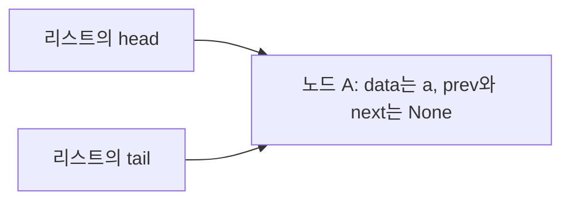

# B5-1 학습 정리 — CLI 기반 Mini Redis

이 문서는 [Subject.txt](Subject.txt)의 핵심 개념과 과제를 마친 뒤 스스로 설명할 수 있어야 할 내용을 정리한다. [Evaluate.txt](Evaluate.txt)의 설명·응용 질문도 학습 범위에 포함한다. `평가 2-1` 같은 표기는 평가 문항 번호다.

학습·구현 범위는 `Subject.txt`의 필수 요구사항과 `Evaluate.txt`의 평가 내용이다. 보너스 과제는 제외한다. 아래 예시와 설계 대안은 이해를 돕기 위한 것이며, 특정 대안을 필수 구현으로 추가하지 않는다. 구현 순서는 다음 단계의 `CHECK.md`에서 정하고, 코드 구현은 작은 클래스·함수 단위로 진행한다.

## 1. 이 과제를 통해 배울 것

**근거: Subject 1~4장, 평가 항목 1~4**

In-Memory Key-Value 저장소는 실행 중인 프로그램의 메모리에 키와 값을 보관한다. 이번 과제에서는 키로 문자열 값을 찾고, 메모리가 부족하면 사용 순서에 따라 데이터를 제거하고, 정해진 시간이 지나면 데이터를 만료시킨다.

| 핵심 키워드 | 과제와의 연결 | 마친 뒤 설명할 내용 |
| --- | --- | --- |
| 이중 연결 리스트, 노드 참조 | 최근 사용 순서 유지 | 어떤 연결을 바꾸기에 삽입·삭제·이동이 O(1)인가 |
| 해시 함수, 버킷, 체이닝 | 키로 데이터 조회 | 문자열이 인덱스로 바뀌는 과정과 충돌 처리 |
| 로드 팩터, 재해싱 | 해시맵 확장 | 0.75 초과 시 버킷을 2배로 늘리고 재배치하는 이유 |
| LRU, MRU | 메모리 초과 시 제거 대상 결정 | 해시맵과 연결 리스트를 함께 사용하는 이유 |
| 최소 힙, 완전 이진 트리 | 가장 빠른 만료 조회 | 최소값을 빠르게 찾고 갱신하는 원리 |
| TTL, 만료 시각, 지연 삭제 | `EXPIRE`, `TTL` | 만료 확인과 오래된 만료 기록 처리 |
| UTF-8, 바이트, 메모리 집계 | `INFO memory`, 메모리 제한 | 저장·덮어쓰기·삭제 시 사용량 변화 |
| REPL, 파싱, 입력 검증 | CLI 명령 처리 | 입력을 명령과 인자로 나누고 결과를 출력하는 흐름 |
| LFU, 병목, 오버헤드 | 평가의 응용 질문 | 조건이 바뀌면 자료구조와 비용이 어떻게 달라지는가 |

## 2. 구현 범위와 제약

**근거: Subject 2장, 4장, 6~7장**

- Python 3.8 이상에서 실행하는 CLI 프로그램이다.
- 기본 명령 6개, 메모리 관리 명령 2개, TTL 관리 명령 2개를 구현한다.
- 이중 연결 리스트·해시맵·최소 힙을 직접 구현하고, 각각 독립된 모듈/파일로 분리한다.
- 핵심 클래스와 함수에는 주석 또는 docstring을 작성한다.
- `dict`, `set`, `collections`를 사용하지 않는다. TTL 정보나 LRU 보조 조회도 이 제한을 따라야 한다.
- 고정 길이 배열과 인덱스 접근 수준의 저장소는 제한적으로 선택할 수 있다. 배열 저장소를 이용하는 것과 내장 컬렉션으로 해시맵·캐시를 대신하는 것은 구분한다.
- 힙도 직접 구현 대상이다. 기존 힙 API 호출만으로 `push`, `pop`, heapify 구현을 대신하면 직접 구현 요구를 충족하지 않는다.
- 네트워크 통신, 파일 영속성, Redis의 List/Set/Sorted Set은 구현하지 않는다. 멀티스레딩과 락은 요구하지 않는다.

이 과제의 완료 기준은 명세에 적힌 Mini Redis다. 실제 Redis의 모든 옵션이나 내부 구현을 재현할 필요는 없다. 또한 다른 과제에서 허용했던 내장 자료형이나 요구했던 제출물을 이번 과제에 그대로 적용하지 않는다.

## 3. 시간복잡도를 읽는 기준

**근거: Subject 3장, 4장 「기본 자료구조 직접 구현」, 평가 2-1·3-2·4-2**

`n`은 저장된 키 수, `b`는 해시맵 버킷 수, `h`는 힙에 남아 있는 기록 수로 둔다. 지연 삭제를 선택하면 `h`와 현재 TTL이 설정된 키 수는 다를 수 있다.

| 표기 | 의미 | 이번 과제의 예 |
| --- | --- | --- |
| O(1) | 데이터 개수에 비례해 작업량이 증가하지 않음 | 위치를 아는 노드의 연결 변경, 힙의 맨 위 조회 |
| O(log h) | 힙의 높이 정도만 따라감 | 최소 힙의 위·아래 정렬 복구 |
| O(n) | 키 개수에 비례해 작업량이 증가함 | 모든 키를 결과로 나열하기 |
| O(n + b) | 원소와 버킷을 모두 살펴봄 | 체이닝 해시맵 전체 순회 |

**평균·최악·분할 상환을 구분한다.** 해시가 고르게 분산되고 로드 팩터가 관리되면 키 조회는 평균 O(1)이지만, 한 버킷에 몰리면 최악 O(n)이다. 확장이 일어나는 한 번의 삽입에는 재배치 비용이 추가된다. 여러 연산에 걸쳐 확장 비용을 나누어 보는 것이 분할 상환 분석이다.

문자열 길이도 비용에 영향을 준다. 길이 `k`인 키를 끝까지 읽는 해시 함수는 O(k)다. “평균 O(1) 조회”는 흔히 키 길이를 일정하다고 놓고 키 개수에 대한 비용을 설명한 표현이다.

**스스로 설명해 보기:** LRU 노드 이동이 O(1)이라는 사실만으로 `GET` 명령 전체가 항상 O(1)이라고 말할 수 있는가?

## 4. 이중 연결 리스트

**근거: Subject 4장 「이중 연결 리스트」, 평가 2-1**

노드는 데이터를 담고 다른 노드를 참조하는 단위다. `prev`는 이전 노드, `next`는 다음 노드, `data`는 저장할 내용이다. 참조는 옆 노드를 복사한 값이 아니라 그 노드에 접근하기 위한 연결이다.

예를 들어 `A ↔ B ↔ C`에서 B를 제거할 때는 A와 C가 서로 연결되도록 바꾼다. B의 위치를 이미 알고 있다면 리스트 전체를 순회할 필요가 없다.

| 필수 메서드 | 역할 | O(1)을 위한 핵심 |
| --- | --- | --- |
| `insert_front` | 맨 앞에 삽입 | 앞쪽 경계의 연결만 변경 |
| `insert_back` | 맨 뒤에 삽입 | 뒤쪽 경계의 연결만 변경 |
| `remove_front` | 맨 앞 노드 제거 | 앞 노드를 바로 알 수 있음 |
| `remove_back` | 맨 뒤 노드 제거 | 뒤 노드를 바로 알 수 있음 |
| `remove_node` | 지정한 노드 제거 | 대상 노드의 참조를 이미 가지고 있음 |
| `move_to_front` | 지정한 노드를 맨 앞으로 이동 | 연결을 끊고 앞에 다시 연결 |

`remove_node`가 데이터 값으로 대상을 처음부터 검색하면 그 검색은 O(n)이다. **노드를 찾는 작업과 노드의 연결을 바꾸는 작업을 분리해서** 설명해야 한다.

빈 리스트, 노드 한 개, 맨 앞·맨 뒤·중간 노드의 경우에도 양방향 연결이 맞아야 한다. 실제 첫·끝 노드를 직접 관리할지, 경계 처리를 돕는 더미 노드인 센티널을 둘지는 설계 선택이다.

**스스로 설명해 보기:** 노드가 한 개일 때 `remove_back`을 실행하면 앞쪽과 뒤쪽 상태는 각각 어떻게 되어야 하는가?

### 첫 구현 단위: 노드와 빈 리스트의 상태

이번 구현에서는 센티널 없이 `head`가 실제 첫 노드, `tail`이 실제 마지막 노드를 가리키는 방식을 사용한다. 명세가 허용하는 구현 선택이며, `CHECK.md`의 D1에 기록한다. 두 끝의 참조를 보관하면 앞이나 뒤에 접근할 때 전체 노드를 탐색할 필요가 없다.

`Node`는 데이터 하나와 이웃 노드의 연결을 관리하고, `DoublyLinkedList`는 리스트 전체의 양 끝을 관리한다. 첫 구현 단위의 대상은 두 클래스의 생성자이며, 삽입·삭제는 이후 단위에서 다룬다.

| 생성한 대상 | 속성 | 초기 상태 |
| --- | --- | --- |
| `Node("a")` | `data` | 전달받은 문자열 `"a"` |
| `Node("a")` | `prev`, `next` | 아직 이웃이 없으므로 각각 `None` |
| 빈 `DoublyLinkedList()` | `head`, `tail` | 아직 노드가 없으므로 각각 `None` |

노드의 `data: object`는 저장할 내용을 문자열로 한정하지 않기 위한 타입 표기다. 이후 해시맵의 엔트리 등도 담을 수 있도록 전달받은 객체를 그대로 보관한다. 여기에서 문자열 변환이나 복사는 필요하지 않다.

노드 하나가 리스트에 들어가면 `head`와 `tail`은 **동일한 노드 객체**를 가리킨다. 같은 값을 가진 노드 두 개를 따로 만드는 의미가 아니다. 첫 단위에서는 노드 생성과 빈 리스트 생성까지 구현하고, 이 연결은 삽입 단계에서 만든다.

**구현 후 확인할 상태:** `Node("a")`와 `Node("b")`를 각각 만들었을 때 데이터가 구분되고 각 노드의 양쪽 참조는 비어 있어야 한다. 별도로 생성한 빈 리스트의 양 끝도 비어 있어야 한다.

### 앞쪽 삽입: insert_front

**대응: CHECK 1-1의 `insert_front` / 근거: Subject 4장 「이중 연결 리스트」**

이번 메서드의 형태는 `insert_front(self, data: object) -> Node`다. 데이터를 받아 새 노드를 만들고 맨 앞에 연결한 뒤, **실제로 삽입한 노드 객체**를 반환한다. 반환값을 노드로 정한 것은 내부 API의 설계 선택이다. 이후 LRU 추적에서 같은 노드에 직접 접근할 수 있도록 참조를 보관하는 데 사용한다.

#### 입력 데이터와 노드 객체를 구분하기

`linked.insert_front("a")`를 호출했다고 생각해 보자. 메서드 안의 `self`는 `linked`라는 리스트 객체이고, `data`는 전달받은 문자열 `"a"`다. `data: object`라는 타입 표기가 입력을 자동으로 `Node`로 바꾸지는 않는다.

앞서 구현한 `Node` 생성자는 전달받은 데이터를 보관하고, `prev`·`next`를 `None`으로 초기화한다. 따라서 데이터에서 노드를 만드는 일은 그 생성자를 호출하는 일이다. 아래는 이 차이를 확인하기 위한 작은 예시이며, `insert_front`의 완성 코드가 아니다.

```python
value = "a"
node = Node(value)
```

| 표현 | 실제로 가리키는 것 | 역할 |
| --- | --- | --- |
| `value` | 문자열 `"a"` | 저장할 내용 |
| `node` | 새 `Node` 객체 하나 | 내용과 앞뒤 연결을 함께 보관 |
| `node.data` | 문자열 `"a"` | 노드 안의 내용 |
| `node.prev` | `None` | 아직 이전 노드 없음 |
| `node.next` | `None` | 아직 다음 노드 없음 |

문자열 `"a"` 자체에는 노드의 `prev`·`next` 속성이 없다. 그래서 `head`에 문자열을 바로 저장하면 나중에 `head.next`로 다음 노드를 찾을 수 없다. `head`와 `tail`에는 **노드 객체의 참조**를 저장해야 한다.

#### 빈 리스트에 첫 노드를 넣는 경우

처음에는 `head`와 `tail`이 모두 `None`이다. 이때 새 노드 A 하나를 넣으면 A가 첫 노드이면서 동시에 마지막 노드가 된다.



두 화살표는 같은 노드 하나를 가리킨다. `head`용 노드와 `tail`용 노드를 각각 만드는 것이 아니다. 또한 두 참조를 같은 노드로 지정한다고 그 노드의 `prev`·`next`가 자동으로 자신을 가리키게 되는 것도 아니다. 리스트의 양 끝 정보와 노드 내부 연결은 서로 다른 속성이다.

빈 상태에서는 연결할 이웃이 없으므로 새 노드의 `prev`·`next`는 생성자가 설정한 `None`을 유지한다. 우선 **새 노드 생성 → 리스트의 양 끝에서 그 노드를 참조 → 삽입한 노드 반환**이라는 흐름을 코드로 옮긴다.

함수 선언의 `-> Node`는 기대하는 반환 타입을 나타낸다. 자동으로 노드를 반환해 주지는 않으며, 실제 `return` 없이 함수 끝에 도달하면 Python은 `None`을 반환한다. 반환한 노드를 호출자가 보관할 수 있어야 이후 그 노드를 검색 없이 직접 이동하거나 삭제할 수 있다.

#### 기존 노드가 있는 경우와 비교하기

빈 리스트와 이미 노드가 있는 리스트를 구분해서 생각한다. X는 이번에 생성한 노드, A·B는 기존 노드다. 아래 표는 대입 순서가 아니라 **삽입을 마친 뒤의 상태**다.

| 확인할 대상 | 빈 리스트에 X 삽입 | `A ↔ B` 앞에 X 삽입 |
| --- | --- | --- |
| 전체 연결 | X 하나 | `X ↔ A ↔ B` |
| `head` | X | X |
| `tail` | X | 기존 B 유지 |
| X의 `prev` | `None` | `None` |
| X의 `next` | `None` | A |
| 기존 첫 노드의 `prev` | 기존 노드 없음 | A의 `prev`가 X를 가리킴 |
| 반환값 | X 객체 | X 객체 |

기존 노드가 A 하나뿐이었다면 삽입 후 `X ↔ A`가 되고 `tail`은 A를 유지한다. `next`뿐 아니라 반대 방향의 `prev`도 연결되어야 이중 연결 리스트가 된다.

연결을 바꾸는 동안 기존 첫 노드를 계속 참조할 수 있어야 한다. `head`를 새 노드로 바꾼 뒤에는 `self.head`가 무엇을 가리키는지 달라지므로, 대입 순서를 생각해 본다. 실수로 새 노드가 자신을 가리키게 연결하지 않도록 한다.

삽입 위치는 이미 `head`로 알고 있다. 노드 수와 관계없이 새 노드 생성과 몇 개의 참조 변경으로 끝나야 O(1)이며, 전체 리스트를 순회할 필요가 없다.

**구현 후 확인할 상태:** 빈 리스트에 `"a"`, `"b"`, `"c"`를 차례로 앞쪽 삽입하면 순방향은 `c → b → a`, 역방향은 `a → b → c`다. 양 끝 바깥의 참조는 `None`이어야 하고, 매번 반환한 객체는 그 호출에서 삽입한 노드여야 한다. 같은 데이터를 두 번 삽입해도 노드는 각각 새로 생성한다.

### 뒤쪽 삽입: insert_back

**대응: CHECK 1-1의 `insert_back` / 근거: Subject 4장 「이중 연결 리스트」, 평가 2-1**

호출 흐름은 **데이터 전달 → 새 노드 생성 → 빈 상태인지에 따라 뒤쪽 연결 구성 → 삽입한 노드 반환**이다. 형태는 `insert_back(self, data: object) -> Node`로 정한다. `insert_front`와 동일하게 삽입한 노드를 반환하는 것은 내부 API의 설계 선택이며, 명세가 반환 타입을 지정한 것은 아니다.

#### 호출과 연결을 실제 값으로 따라가기

이미 `A ↔ B`가 있고 A의 `data`는 `"a"`, B의 `data`는 `"b"`라고 하자. 이때 `linked.insert_back("c")`를 호출하면 `self`는 리스트 객체, `data`는 문자열 `"c"`다. 새로 만드는 노드를 C라고 부르면 C의 `data`는 `"c"`이고, 아직 연결하기 전에는 C의 `prev`·`next`가 모두 `None`이다. A·B·C는 설명을 위한 노드 이름이다.

삽입이 끝나면 `A ↔ B ↔ C`가 되어야 한다. B에서 C로 갈 수 있도록 **기존 마지막 노드의 `next`**를 연결하고, C에서 B로 돌아올 수 있도록 **새 노드의 `prev`**도 연결한다. 리스트의 `tail`은 새 마지막 노드 C를 가리키며, `head`는 계속 A를 가리킨다. `tail`만 바꾸면 B와 C 사이의 연결은 생기지 않는다.

| 확인할 대상 | 삽입 전 | 삽입 후 |
| --- | --- | --- |
| `head` | A | A 유지 |
| `tail` | B | C |
| B의 `next` | `None` | C |
| C의 `prev` | 생성 직후 `None` | B |
| C의 `next` | 생성 직후 `None` | `None` 유지 |
| 반환값 | 호출 전 | 실제로 삽입한 C 객체 |

기존 마지막 노드와 새 노드를 연결하는 동안, 기존 마지막 노드를 계속 참조할 수 있어야 한다. `tail`을 먼저 C로 바꾸면 이후의 `self.tail`은 B가 아니라 C를 뜻한다. 각 대입 시점에 `self.tail`이 어떤 노드인지 생각하며 순서를 정한다.

#### 빈 리스트와 노드 한 개의 경우

빈 리스트에서는 기존 마지막 노드가 없으므로 그 노드의 `next`에 접근할 수 없다. C가 첫 노드이자 마지막 노드가 되도록 `head`와 `tail`이 **같은 C 객체**를 가리키게 한다. C의 `prev`·`next`는 모두 `None`을 유지한다. 첫 노드를 넣는 경우는 앞쪽 삽입과 뒤쪽 삽입의 결과가 같다.

기존 노드가 A 하나라면 삽입 전에는 `head`와 `tail`이 모두 A다. 뒤에 C를 붙인 결과는 `A ↔ C`이며, `head`는 A를 유지하고 `tail`은 C가 된다. 기존 노드가 여러 개인 경우와 같은 뒤쪽 연결 원리가 적용된다. 빈 리스트이든 기존 노드가 있든 반환값은 이번에 삽입한 새 노드다.

#### O(1)과 확인할 상태

`tail`이 마지막 노드를 이미 가리키므로 `head`에서 출발해 마지막 노드를 찾는 반복문이 필요 없다. 노드가 1개든 1만 개든 끝부분의 정해진 참조만 바꾸므로 삽입은 O(1)이다. 확인을 위해 전체 노드를 따라가는 작업은 O(n)일 수 있지만, 그 순회를 `insert_back` 안에 넣지 않는다.

- 빈 리스트에 `"a"`, `"b"`, `"c"`를 차례로 뒤쪽 삽입하면 순방향은 `a → b → c`, 역방향은 `c → b → a`다.
- 첫 삽입 직후 `head`와 `tail`은 같은 노드이며, 여러 번 삽입한 뒤에도 `head.prev`와 `tail.next`는 `None`이다.
- 매번 반환한 객체는 해당 호출에서 만든 새 마지막 노드다. 같은 데이터를 두 번 넣어도 노드는 각각 새로 생성한다.
- 새 리스트에서 `insert_back("b")` → `insert_front("a")` → `insert_back("c")`를 호출하면 순방향은 `a → b → c`, 역방향은 `c → b → a`다. 앞뒤 삽입을 섞어도 연결이 유지되어야 한다.

### 앞쪽 삭제: remove_front

**대응: CHECK 1-2의 `remove_front` / 근거: Subject 4장 「이중 연결 리스트」, 평가 2-1**

호출 흐름은 **빈 상태 확인 → 기존 첫 노드 참조 보관 → 남은 리스트의 앞쪽 경계 갱신 → 제거한 노드의 연결 정리 → 제거한 노드 반환**이다. 빈 리스트라면 제거할 대상이 없으므로 바로 `None`을 반환한다.

형태는 `remove_front(self) -> Optional[Node]`다. 호출자가 삭제할 데이터를 넘기지 않아도 `head`로 대상을 알 수 있다. `Optional[Node]`는 반환값이 `Node` 또는 `None`이라는 뜻이며, Python 3.8에서도 사용할 수 있도록 `typing`에서 가져온 타입 표기다. 반환할 때 새 노드를 만들거나 `data`만 꺼내 반환하지 않고, 리스트에 들어 있던 기존 노드 자체를 반환한다.

명세가 정한 것은 앞쪽 삭제와 O(1) 처리다. **제거한 노드 반환, 빈 경우 `None` 반환, 제거한 노드의 `prev`·`next`를 `None`으로 정리하는 규칙은 이번 내부 API의 설계 선택**이며 `CHECK.md`의 D1에 기록한다. 노드의 `data`는 유지한다.

#### 호출과 연결을 실제 값으로 따라가기

`A ↔ B ↔ C`가 있고 각 노드의 `data`가 차례로 `"a"`, `"b"`, `"c"`라고 하자. `removed = linked.remove_front()`를 호출하면 `self`는 `linked` 리스트 객체이며, 제거 대상은 호출 직전 `head`가 가리키던 A다. 작업 후 리스트에는 `B ↔ C`가 남고, 호출자의 `removed`는 A를 가리켜야 한다. 따라서 `removed.data`는 여전히 `"a"`다.

| 확인할 대상 | 삭제 전 | 삭제 후 |
| --- | --- | --- |
| `head` | A | B |
| `tail` | C | C 유지 |
| B의 `prev` | A | `None` |
| B의 `next` | C | C 유지 |
| A의 `next` | B | `None` |
| A의 `prev` | `None` | `None` 유지 |
| 반환값 | 호출 전 | 기존 A 객체 |

`head`만 B로 옮기면 B의 `prev`는 여전히 A를 가리킨다. 그러면 뒤에서 `prev`를 따라갈 때 제거한 A까지 다시 도달한다. 새 첫 노드의 `prev`도 비워야 양방향으로 같은 리스트를 나타낸다.

반대로 제거한 A의 `next`는 B를 가리키므로, A도 남은 리스트와 분리하려면 그 연결을 정리한다. 이것은 A 객체 자체나 `data`를 없애는 작업이 아니다. 삽입 때 반환받아 보관했던 A와 삭제 때 반환받은 A는 같은 객체여야 한다.

대입 순서에는 두 가지 주의점이 있다. `head`를 바꾸기 전에 반환할 기존 첫 노드를 따로 참조해 두어야 한다. 또한 A의 `next`를 먼저 비우면 그 경로로 B를 찾을 수 없으므로, 다음 노드를 새 `head`로 정하거나 그 참조를 확보한 뒤 A의 연결을 정리한다.

#### 빈 리스트, 노드 한 개, 여러 개 구분하기

아래는 대입 순서가 아니라 각 경우의 완료 상태다.

| 호출 전 상태 | 호출 후 `head` | 호출 후 `tail` | 반환값 | 경계 처리 |
| --- | --- | --- | --- | --- |
| 빈 리스트 | `None` 유지 | `None` 유지 | `None` | 노드의 속성에 접근할 대상이 없음 |
| A 하나 | `None` | `None` | 기존 A | 마지막 노드를 없앴으므로 양 끝 모두 비움 |
| `A ↔ B ↔ C` | B | C 유지 | 기존 A | 새 첫 노드 B의 `prev`를 비움 |

노드가 하나일 때는 A의 다음 노드가 없으므로 제거 후 `head`가 `None`이다. 이 경우 새 첫 노드의 `prev`에 접근하면 오류가 난다. 남은 노드가 있는 경우와 없는 경우에 필요한 처리가 다르다는 점을 생각한다. `tail`도 A를 계속 가리키지 않도록 해야 한다.

#### O(1)과 확인할 상태

제거 대상은 `head`, 그 다음 노드는 기존 첫 노드의 `next`로 바로 알 수 있다. 나머지 노드를 옮기거나 끝까지 순회할 필요 없이 정해진 참조만 바꾸므로 O(1)이다.

- 빈 리스트에서 호출하면 `None`을 반환하고 `head`·`tail`도 `None`을 유지한다.
- 노드 하나를 삽입한 뒤 제거하면 삽입 때 반환받았던 바로 그 노드를 반환하고, 리스트의 양 끝은 모두 `None`이 된다.
- `"a"`, `"b"`, `"c"`를 뒤쪽 삽입한 뒤 한 번 제거하면 순방향은 `b → c`, 역방향은 `c → b`다. 반환한 노드는 `data`가 `"a"`이고 `prev`·`next`는 모두 `None`이다.
- 계속 제거하면 기존 B, C 순서로 반환되고 리스트가 비어진다. 빈 상태에서 다시 제거해도 `None`을 반환하며, 다시 삽입했을 때도 양 끝과 연결이 올바르게 구성되어야 한다.

### 뒤쪽 삭제: remove_back

**대응: CHECK 1-2의 `remove_back` / 근거: Subject 4장 「이중 연결 리스트」, 평가 2-1**

호출 흐름은 **빈 상태 확인 → 기존 마지막 노드 참조 보관 → 남은 리스트의 뒤쪽 경계 갱신 → 제거한 노드의 연결 정리 → 제거한 노드 반환**이다. 형태는 `remove_back(self) -> Optional[Node]`로 정한다. `remove_front`와 같은 내부 규칙을 사용하며, 빈 경우 `None`을 반환하고, 제거한 기존 노드는 `data`를 유지한 채 `prev`·`next`가 모두 `None`인 상태로 반환한다. 이 반환 방식과 분리된 노드의 참조 정리는 명세가 고정한 조건이 아닌 D1의 설계 선택이다.

#### 호출과 연결을 실제 값으로 따라가기

`A ↔ B ↔ C`에 차례로 `"a"`, `"b"`, `"c"`가 담겨 있다고 하자. `removed = linked.remove_back()`를 호출하면 `self`는 리스트 객체이고, 제거 대상은 호출 직전 `tail`이 가리키는 C다. 작업 후 리스트에는 `A ↔ B`가 남고, `removed`는 기존 C 객체를 가리킨다. `removed.data`는 `"c"`다.

| 확인할 대상 | 삭제 전 | 삭제 후 |
| --- | --- | --- |
| `head` | A | A 유지 |
| `tail` | C | B |
| B의 `next` | C | `None` |
| B의 `prev` | A | A 유지 |
| C의 `prev` | B | `None` |
| C의 `next` | `None` | `None` 유지 |
| 반환값 | 호출 전 | 기존 C 객체 |

`tail`만 B로 옮기면 B의 `next`는 여전히 C를 가리키므로, 앞에서 `next`를 따라갈 때 제거한 C까지 도달한다. **새 마지막 노드 B의 `next`를 비우는 작업**과 **반환할 C의 `prev`를 비우는 작업**은 서로 다른 노드의 연결을 정리한다.

`remove_front`에서는 제거 대상의 `next`가 새 첫 노드였지만, `remove_back`에서는 제거 대상의 `prev`가 새 마지막 노드다. `tail`을 바꾸기 전에 반환할 기존 마지막 노드를 따로 참조해 둔다. 또한 C의 `prev`를 비우기 전에 B를 새 `tail`로 정하거나 B의 참조를 확보해야 한다.

#### 빈 리스트, 노드 한 개, 여러 개 구분하기

| 호출 전 상태 | 호출 후 `head` | 호출 후 `tail` | 반환값 |
| --- | --- | --- | --- |
| 빈 리스트 | `None` 유지 | `None` 유지 | `None` |
| A 하나 | `None` | `None` | 기존 A |
| `A ↔ B ↔ C` | A 유지 | B | 기존 C |

노드가 한 개일 때는 그 노드가 첫 노드이자 마지막 노드다. 제거 후 `tail`뿐 아니라 `head`도 비워야 한다. 새 마지막 노드가 없는 경우에는 그 노드의 `next`에 접근할 수 없다는 점도 구분한다.

#### O(1)과 확인할 상태

제거 대상은 `tail`, 그 이전 노드는 대상의 `prev`로 바로 알 수 있다. `head`에서부터 이전 노드를 찾아가는 순회가 필요 없으므로 O(1)이다.

- 빈 리스트에서 호출하면 `None`을 반환한다. 노드 하나를 넣고 제거한 뒤에도 양 끝이 `None`이고, 다시 제거하면 `None`을 반환한다.
- `"a"`, `"b"`, `"c"`를 뒤쪽 삽입한 뒤 한 번 제거하면 순방향은 `a → b`, 역방향은 `b → a`다. 반환값은 삽입 때 받았던 기존 C 객체이며, 그 노드의 `prev`·`next`는 모두 `None`이어야 한다.
- 계속 뒤에서 제거하면 기존 B, A 순서로 반환된다. 모두 제거한 뒤 앞쪽·뒤쪽으로 다시 삽입할 수 있어야 한다.
- 새 리스트의 `A ↔ B ↔ C`에서 `remove_front()` → `remove_back()` → `remove_back()`을 호출하면 기존 A, C, B를 차례로 반환하고 빈 상태가 된다. 매번 남은 리스트의 양방향 연결과 양 끝을 확인한다.

### 지정 노드 삭제: remove_node

**대응: CHECK 1-3의 `remove_node` / 근거: Subject 4장 「이중 연결 리스트」, 평가 2-1**

호출 흐름은 **삭제할 노드의 참조 전달 → 앞뒤 이웃과 경계 확인 → 남은 노드의 연결과 필요한 경계 갱신 → 대상 노드 분리 → 해당 노드 반환**이다. 형태는 `remove_node(self, node: Node) -> Node`로 정한다. `node`는 호출 시점에 이 리스트에 연결되어 있는 노드이며, 호출자가 이 조건을 보장한다. 이 입력 전제와 반환 규칙은 D1의 내부 설계 선택이다.

`remove_front`·`remove_back`은 리스트의 경계에서 대상을 결정하지만, 이번에는 호출자가 이미 알고 있는 대상 노드를 직접 전달한다. 유효한 노드를 전달받는 호출 규칙이므로 반환 타입도 `Node`다. 빈 리스트에는 전달할 대상 노드가 없으며, 빈 상태에서의 무인자 삭제는 앞서 만든 양 끝 삭제 메서드가 담당한다.

#### 입력은 데이터가 아니라 기존 노드 객체

아래는 메서드 사용 예시이며, 삭제 기능의 구현 코드가 아니다.

```python
linked = DoublyLinkedList()
a = linked.insert_back("a")
b = linked.insert_back("b")
c = linked.insert_back("c")
removed = linked.remove_node(b)
```

`b`는 문자열 `"b"`가 아니라 삽입 때 반환받은 `Node` 객체다. `b.data`가 문자열 `"b"`이고, 삭제 직전 `b.prev`는 a 노드, `b.next`는 c 노드를 가리킨다. `remove_node` 안의 `self`는 `linked`, `node`는 이 b 객체다. 값을 검색하거나 새 노드를 생성할 필요가 없다.

#### 중간 노드를 제거할 때 바뀌는 연결

위 예시의 노드를 A·B·C라고 부르면, B를 제거한 결과는 `A ↔ C`다. A가 앞으로 갈 때 C에 도착하고, C가 뒤로 갈 때 A에 도착하도록 연결한다.

| 확인할 대상 | 삭제 전 | 삭제 후 |
| --- | --- | --- |
| A의 `next` | B | C |
| C의 `prev` | B | A |
| `head` | A | A 유지 |
| `tail` | C | C 유지 |
| B의 `prev`·`next` | A·C | 모두 `None` |
| 반환값 | 호출 전 | 기존 B 객체 |

B의 연결만 비워서는 A와 C가 서로 연결되지 않는다. 남은 이웃의 연결을 갱신한 뒤 B를 분리한다. B의 `prev`·`next`를 먼저 비우려면 이웃 참조를 별도로 보관해야 하므로, 각 시점에 A와 C에 접근할 수 있는지 생각하며 순서를 정한다. 반환한 B의 `data`는 그대로 유지한다.

#### 맨 앞·맨 뒤·노드 하나일 때의 경계

| 삭제 전 리스트와 대상 | 남은 리스트 | `head` | `tail` | 남은 노드의 경계 연결 |
| --- | --- | --- | --- | --- |
| `A ↔ B ↔ C`에서 A | `B ↔ C` | B로 변경 | C 유지 | B의 `prev`는 `None` |
| `A ↔ B ↔ C`에서 B | `A ↔ C` | A 유지 | C 유지 | A와 C를 양방향으로 연결 |
| `A ↔ B ↔ C`에서 C | `A ↔ B` | A 유지 | B로 변경 | B의 `next`는 `None` |
| A 하나에서 A | 빈 리스트 | `None` | `None` | 남은 노드 없음 |

대상의 이전 노드가 없다면 대상이 맨 앞이고, 다음 노드가 없다면 맨 뒤다. **노드가 하나면 두 조건이 동시에 성립**하므로 양쪽 경계를 모두 처리해야 한다. 존재하지 않는 이웃의 속성에는 접근할 수 없다. 이미 만든 양 끝 삭제 메서드를 활용하거나 이웃 유무에 따라 직접 연결을 바꾸는 방식 모두 가능하며, 위 완료 상태와 O(1) 조건을 만족하면 된다.

#### 노드 하나를 제외해도 양쪽 이웃이 항상 있는 것은 아니다

`(node == self.head) and (node == self.tail)`은 대상이 첫 노드이면서 마지막 노드인지 확인한다. 현재 `Node` 클래스에서 다음처럼 판정된다.

| 호출 상황 | `node == self.head` | `node == self.tail` | 두 조건의 `and` 결과 |
| --- | --- | --- | --- |
| A 하나에서 A 제거 | `True` | `True` | `True` |
| `A ↔ B ↔ C`에서 A 제거 | `True` | `False` | `False` |
| `A ↔ B ↔ C`에서 B 제거 | `False` | `False` | `False` |
| `A ↔ B ↔ C`에서 C 제거 | `False` | `True` | `False` |

따라서 이 조건의 `else`에는 맨 앞·중간·맨 뒤가 모두 들어간다. "노드 하나인 경우가 아니다"만으로 "양쪽 이웃이 있다"고 판단할 수는 없다.

양쪽 이웃을 서로 연결하는 아래 두 줄은 **`next_node`와 `prev_node`가 모두 실제 노드일 때** 사용할 수 있다.

```python
next_node.prev = prev_node
prev_node.next = next_node
```

B 제거에서는 `prev_node`가 A, `next_node`가 C다. 첫 줄이 C의 `prev`를 A로, 둘째 줄이 A의 `next`를 C로 바꾸므로 `A ↔ C`가 된다.

A 제거에서는 `prev_node`가 `None`, `next_node`가 B다. 첫 줄은 B의 `prev`에 `None`을 저장하므로 가능하지만, 둘째 줄은 `None.next`에 접근하므로 오류가 난다. A의 앞에는 연결할 노드가 없고, 리스트의 시작을 나타내는 `head`를 B로 갱신해야 한다. B의 `prev`는 `None`, `tail`은 기존 C가 되어야 한다.

C 제거에서는 `prev_node`가 B, `next_node`가 `None`이다. 첫 줄부터 `None.prev`에 접근하므로 오류가 난다. C의 뒤에는 연결할 노드가 없고, 리스트의 끝을 나타내는 `tail`을 B로 갱신해야 한다. B의 `next`는 `None`, `head`는 기존 A가 되어야 한다.

**실제 노드의 속성에 `None`을 저장하는 것과, `None` 자체의 속성에 접근하는 것은 다르다.** 남은 이웃이 있는 쪽은 그 노드의 연결을 바꾸고, 이웃이 없는 쪽은 리스트의 경계를 바꾼다는 관점으로 구분한다.

#### O(1)과 확인할 상태

대상 노드와 양쪽 이웃을 이미 참조할 수 있으므로 정해진 연결만 바꾸면 된다. 값으로 대상을 찾거나, 소속 확인을 위해 처음부터 끝까지 순회하면 그 검색은 O(n)이 된다. 이번 입력 규칙에서는 호출자가 대상 노드의 소속을 보장하므로 메서드 안에서 검색할 필요가 없다.

- 각각 새로 만든 `A ↔ B ↔ C`에서 맨 앞·중간·맨 뒤를 하나씩 지정해 제거한다. 남은 노드의 순방향·역방향 순서와 `head`·`tail`을 확인한다.
- 노드 하나를 지정해 제거하면 양 끝이 `None`이 된다. 이후 다시 삽입해도 정상적으로 연결되어야 한다.
- 같은 데이터가 든 서로 다른 노드를 넣고 그중 하나를 지정해 제거한다. 전달한 바로 그 노드만 빠져야 하며, 반환값도 그 객체여야 한다.
- 제거한 노드는 `prev`·`next`가 모두 `None`이고 `data`는 유지된다. 양 끝 삭제와 지정 노드 삭제를 섞어도 남은 리스트의 연결이 유지되어야 한다.

### 기존 노드를 맨 앞으로 이동: move_to_front

**대응: CHECK 1-3의 `move_to_front` / 근거: Subject 4장 「이중 연결 리스트」, 평가 2-1·3-2**

호출 흐름은 **이동할 기존 노드의 참조 전달 → 이미 맨 앞인지 확인 → 현재 자리에서 분리 → 같은 노드를 맨 앞에 연결**이다. 이미 맨 앞이라면 상태를 유지하고 종료한다. 형태는 `move_to_front(self, node: Node) -> None`으로 정한다. `remove_node`와 마찬가지로 호출자가 현재 이 리스트에 연결된 노드를 전달하며, 반환값을 `None`으로 정한 것은 D1의 내부 API 설계 선택이다.

이동 전후에 노드 객체들, 각 노드의 `data`, 전체 노드 수가 유지되어야 한다. 달라지는 것은 노드의 순서와 그 순서를 나타내는 참조다. 이후 LRU에서 이미 보관한 노드 참조로 최근 사용 순서를 바꿀 때 이 성질을 사용한다.

#### 중간 노드를 옮기는 호출을 따라가기

`A ↔ B ↔ C`가 있고, 삽입 때 반환받은 B를 변수 `b`가 가리킨다고 하자. `linked.move_to_front(b)`를 호출하면 `self`는 리스트 객체, `node`는 기존 B 객체다. 목표는 `B ↔ A ↔ C`이며, 이동 후에도 호출자가 보관한 `b`와 리스트의 `head`는 같은 객체여야 한다.

두 작업으로 나누어 생각할 수 있다.

| 시점 | 리스트의 연결 | B의 상태 | `head` | `tail` |
| --- | --- | --- | --- | --- |
| 이동 전 | `A ↔ B ↔ C` | A와 C 사이 | A | C |
| B를 현재 자리에서 분리한 뒤 | `A ↔ C` | `prev`·`next`가 `None`인 기존 B | A | C |
| 같은 B를 맨 앞에 연결한 뒤 | `B ↔ A ↔ C` | 맨 앞에 연결된 기존 B | B | C |

첫 작업은 앞서 완성한 `remove_node`가 수행할 수 있다. 이 메서드는 노드를 리스트에서 분리하지만 노드 객체와 데이터를 없애지 않는다. 전달받은 `node` 참조로 그 노드에 계속 접근할 수 있다. 직접 이웃의 연결을 갱신하는 방법도 가능하며, 같은 노드를 유지하고 O(1)이어야 한다.

두 번째 작업에서는 분리된 B와 기존 첫 노드 A를 양방향으로 연결한다. 완료 상태에서 B의 `prev`는 `None`, B의 `next`는 A, A의 `prev`는 B이고 `head`는 B다. 기존 첫 노드를 계속 참조할 수 있도록 대입 순서를 생각한다. 기존 자리의 연결을 정리한 다음 앞에 연결해야 한 노드가 두 위치에 걸쳐 연결되는 것을 피할 수 있다.

#### insert_front의 새 노드 생성과 구분하기

현재 `insert_front(data)`는 내부에서 `Node(data)`를 호출해 새 노드를 만든다. 따라서 기존 노드를 분리한 뒤 `insert_front(node.data)`를 호출하면 같은 데이터가 든 다른 노드가 생긴다. 호출자가 보관한 기존 노드 참조와 실제 리스트에 있는 노드가 달라진다. `insert_front(node)`도 새 노드를 만들며, 그 새 노드의 `data`에 기존 노드 객체가 들어간다.

이번 이동에서는 **전달받은 기존 노드 자체를 연결**한다. 두 데이터 값을 맞바꾸는 것도 같은 노드를 옮기는 동작이 아니다. 기존 `insert_front`를 수정할 필요 없이 이번 메서드에서 기존 노드의 연결을 구성하면 된다.

#### 이미 맨 앞, 맨 뒤, 노드 하나인 경우

| 이동 전과 대상 | 이동 후 | `head` | `tail` |
| --- | --- | --- | --- |
| `A ↔ B ↔ C`에서 A | `A ↔ B ↔ C` 유지 | A 유지 | C 유지 |
| `A ↔ B ↔ C`에서 B | `B ↔ A ↔ C` | B | C 유지 |
| `A ↔ B ↔ C`에서 C | `C ↔ A ↔ B` | C | B로 변경 |
| `A ↔ B`에서 B | `B ↔ A` | B | A로 변경 |
| A 하나에서 A | A 유지 | A 유지 | A 유지 |

노드 하나인 경우도 이미 맨 앞인 경우에 포함된다. 이미 맨 앞인 노드는 그대로 두도록 처리하면, 분리가 필요한 경우에는 노드가 적어도 두 개다. 따라서 하나를 분리한 뒤에도 앞에 연결할 기존 노드가 남아 있다.

맨 뒤 C를 옮길 때는 C를 분리하는 과정에서 B가 마지막 노드가 된다. 그다음 C를 맨 앞에 연결해도 `tail`은 B를 유지해야 한다. `remove_node`를 활용한다면 이 뒤쪽 경계 갱신은 해당 메서드가 이미 처리한다.

#### O(1)과 확인할 상태

대상은 인자로, 이웃은 대상의 `prev`·`next`로, 기존 첫 노드는 `head`로 바로 알 수 있다. 분리와 앞쪽 연결이 각각 O(1)이면 두 작업을 합친 이동도 O(1)이다. 노드 수에 따라 늘어나는 검색이나 순회는 필요 없다.

- 위 표의 각 경우를 새 리스트에서 확인하고, 순방향·역방향 연결이 서로 반대인지 확인한다. `head.prev`·`tail.next`는 `None`이어야 한다.
- 이동 후의 `head`는 전달한 바로 그 노드다. 기존 노드들이 각각 한 번씩만 나타나며, 데이터와 노드 수가 유지되어야 한다.
- 같은 노드를 연속으로 앞으로 옮겨도 두 번째 호출부터 순서가 유지되고 자기 자신을 가리키는 연결이 생기지 않아야 한다.
- 같은 데이터가 든 서로 다른 노드를 넣고 그중 하나를 지정해 옮긴다. 데이터가 같아도 지정한 객체가 맨 앞이어야 한다.
- 이동 후 지정 노드 삭제·양 끝 삭제·재삽입을 해도 양 끝과 연결이 유지되어야 한다. 반환값은 어느 경우든 `None`이다.

## 5. 해시맵, 체이닝, 재해싱

**근거: Subject 4장 「해시맵」, 평가 2-2~2-4**

### 키에서 버킷까지

해시맵은 키로 저장된 값을 찾는 자료구조다. 바깥에는 버킷 배열이 있고, 각 버킷에는 그 위치에 배정된 엔트리들이 있다. 엔트리 하나에는 키와 그 키에 연결된 값이 들어간다.

문자열 키를 직접 설계한 해시 함수로 정수에 대응시키고, 버킷 수로 나눈 나머지 등을 이용해 인덱스를 만든다. 예를 들어 `index = hash_value % b`라면 결과는 0부터 `b - 1` 사이에 있다. 어떤 문자를 어떤 순서로 반영하는지는 구현 단계에서 정한다.

단순히 문자 코드의 합만 이용하면 `ab`와 `ba`가 같은 결과를 만든다. 이는 해시 함수의 분산을 생각하기 위한 예시이며, 특정 해시 공식을 선택한 것은 아니다. 내장 `hash()` 호출만으로는 해시 함수를 직접 설계한 과정을 설명할 수 없다.

### 충돌과 덮어쓰기는 다르다

| 상황 | 뜻 | 처리의 핵심 |
| --- | --- | --- |
| 다른 키가 같은 버킷에 배정됨 | 해시 충돌 | 두 엔트리를 함께 보관하고 실제 키를 비교 |
| 이미 저장된 키를 다시 `put`함 | 기존 값 갱신 | 같은 키의 값을 바꾸고 키 수는 유지 |

체이닝은 한 버킷에 여러 엔트리를 연결해 보관하는 충돌 해결 방식이다. 명세는 이중 연결 리스트 재사용을 권장하지만, 이를 유일한 방법으로 강제하지는 않는다.

리스트 **구현을 재사용**하는 것과 동일한 **노드 객체를 공유**하는 것은 다르다. 하나의 `prev`·`next` 쌍으로 버킷 순서와 LRU 순서를 동시에 표현할 수는 없다. 두 순서가 다를 수 있기 때문이다.

필수 메서드는 `put`, `get`, `remove`, `contains`, `keys`, `size`다. `get`과 `contains`는 키가 같은지 확인해야 하고, `size`는 사용 중인 버킷 수가 아니라 저장된 키 수다.

### 첫 구현 단위: 엔트리와 빈 버킷 배열

**대응: CHECK 2-1의 버킷·엔트리 표현 / 근거: Subject 4장 「해시맵」, 7장 「제약 사항」, 평가 2-3**

먼저 `HashEntry`와 `HashMap`의 생성자를 구현한다. 호출 흐름은 **`HashMap()` 생성 → 버킷 수 설정 → 독립된 빈 연결 리스트를 버킷마다 준비 → 저장된 키 수를 0으로 초기화**다. 해시 함수가 사용할 버킷 수와, 이후 키·값을 보관할 구조부터 마련하는 단위다. 이 시점에는 키·값을 해시맵에 넣는 작업까지 구현하지 않는다.

초기 버킷 수는 8, 각 버킷은 앞서 구현한 `DoublyLinkedList`로 정한다. 명세가 요구한 것은 직접 구현한 해시 함수·체이닝·로드 팩터에 따른 확장이며, 초기 용량 8이나 이중 연결 리스트 재사용을 유일한 정답으로 지정하지는 않았다. 이번 선택은 CHECK의 D1 추가 기록에 남긴다.

#### 바깥 배열, 버킷의 연결 리스트, 노드, 엔트리 구분하기

버킷 배열은 번호로 바로 접근할 수 있는 바깥 저장소다. 이번 구조에서는 배열의 각 칸이 연결 리스트 하나를 가리킨다. 그 연결 리스트가 같은 버킷으로 배정된 여러 키·값을 이어서 보관할 자리가 된다.

아래는 어떤 두 키가 같은 버킷 `i`로 배정됐다고 가정한 모습이다. 자료구조의 관계를 나타내는 그림이며, 특정 키의 실제 버킷 번호를 계산한 예시는 아니다.

```text
HashMap
 └─ _buckets: 버킷 배열
     ├─ i번 칸 → DoublyLinkedList → Node A ↔ Node B
     │                              │        │
     │                            data     data
     │                              ↓        ↓
     │                          HashEntry  HashEntry
     │                          key/value  key/value
     └─ 다른 칸 → 별도의 DoublyLinkedList
```

| 구성 요소 | 보관하는 것 | 역할 |
| --- | --- | --- |
| 버킷 배열 `_buckets` | 각 버킷의 연결 리스트 참조 | 정수 인덱스로 버킷에 접근 |
| 버킷의 `DoublyLinkedList` | 해당 버킷의 `head`·`tail` | 같은 버킷 안의 노드 연결 관리 |
| 버킷 안의 `Node` | `prev`·`next`·`data` | 이웃 노드 참조와 엔트리 보관 |
| `HashEntry` | `key`·`value` | 실제 키·값 한 쌍 보관 |

`HashEntry("name", "kim")`을 만들면 그 객체의 `key`는 `"name"`, `value`는 `"kim"`이다. 나중에 이 엔트리를 연결 리스트에 넣으면 노드의 `data`가 그 엔트리를 가리킨다. 따라서 `node.data.key`로 키에, `node.data.value`로 값에 접근할 수 있다. `HashEntry` 자체에 `prev`·`next`를 추가할 필요는 없다. 연결은 기존 `Node`가 담당한다.

`value: object`는 이후 저장소의 내부 객체도 보관할 수 있도록 한 설계 선택이다. 생성자는 전달받은 값을 문자열로 변환하거나 복사하지 않고 그대로 보관한다. CLI의 사용자 값이 문자열이라는 요구와, 내부 자료구조가 객체를 보관할 수 있다는 점은 구분한다.

#### 이번 생성자에서 만들 상태

| 대상 | 속성 | 생성 직후의 상태 |
| --- | --- | --- |
| `HashEntry` | `key` | 전달받은 문자열 키 |
| `HashEntry` | `value` | 전달받은 값 객체 |
| `HashMap` | `_capacity` | 초기 버킷 수 `8` |
| `HashMap` | `_buckets` | 길이가 `_capacity`인 배열, 각 칸에 서로 다른 빈 `DoublyLinkedList` |
| `HashMap` | `_size` | 저장된 키가 없으므로 `0` |

**버킷 8개는 키·값 8개가 저장됐다는 뜻이 아니다.** 아직 연결 리스트마다 `head`·`tail`이 `None`이며, 엔트리를 담은 노드는 하나도 없다. 그래서 `_capacity`는 8이지만 `_size`는 0이다. 이후 같은 버킷에 두 키가 들어가도 전체 키 수는 2개이며, 버킷 수와 키 수를 각각 관리해야 한다. `_size`는 숫자를 보관하는 속성이고, 나중에 구현할 `size()`는 그 수를 조회하는 메서드다.

명세가 허용한 배열 저장소로 Python `list`를 선택한다. 현재는 정해진 수의 칸을 확보하고 각 칸에 접근하는 용도로 사용한다. 버킷 안의 키 검색·삽입·삭제를 내장 컬렉션에 맡기는 것이 아니라, 직접 만든 연결 리스트와 해시맵 연산으로 처리한다. 나중에 용량을 늘릴 때는 두 배 크기의 새 버킷 배열을 마련하고 재해싱한다.

#### 버킷마다 다른 연결 리스트가 필요한 이유

배열의 모든 칸이 연결 리스트 객체 하나를 공유하면, 어느 버킷에 넣어도 같은 `head`·`tail`을 바꾸게 된다. 버킷들이 서로 독립적으로 동작하지 못한다. **빈 연결 리스트를 칸마다 별도로 생성**해야 한다. 서로 다른 해시맵 객체를 만들었을 때도 버킷 배열과 각 연결 리스트가 공유되지 않아야 한다.

**이번 단위의 확인 기준:** 엔트리가 전달받은 키·값을 보관하는지, 새 해시맵의 버킷 수가 8이고 키 수가 0인지, 각 버킷이 서로 다른 빈 연결 리스트인지 확인한다. 두 해시맵 사이에도 배열과 버킷 객체가 독립적이어야 한다. 해시 계산·충돌 처리·키 기반 저장·조회는 이후 구현에서 각각 검증한다.

### 두 번째 구현 단위: 문자열에서 버킷 인덱스 계산하기

**대응: CHECK 2-1의 직접 설계한 해시 함수 / 근거: Subject 4장 「해시맵」, 평가 2-2**

이번 메서드는 `_hash(self, key: str) -> int`다. 호출 흐름은 **문자열 키 전달 → 문자를 숫자로 바꿔 누적 → 현재 버킷 수 범위로 맞춤 → 정수 인덱스 반환**이다. 이후 `put`·`get` 등이 이 결과로 `self._buckets[index]`에 접근한다. `_hash` 자체는 엔트리를 저장하거나 찾지 않으며, `_size`나 연결 리스트도 바꾸지 않는다.

입력 `"ab"`는 문자열이고, 반환값은 `7` 같은 정수다. 연결 리스트나 `HashEntry`를 반환하는 메서드가 아니다. 같은 키와 같은 버킷 수에서 같은 번호를 계산해야, 저장할 때와 조회할 때 같은 버킷으로 갈 수 있다.

#### 문자를 숫자로 바꾸고 순서를 반영하기

`ord()`는 문자 하나의 유니코드 번호를 돌려준다. 예를 들어 `ord("a")`는 `97`, `ord("b")`는 `98`이다. 한글 등도 문자별로 처리할 수 있다. 이는 문자에서 숫자를 얻는 도구일 뿐, 문자열 전체의 해시 함수를 대신 구현해 주지는 않는다. 숫자를 어떤 규칙으로 섞을지는 직접 구현한다. 나중에 메모리 사용량을 계산할 때 요구되는 UTF-8 **바이트 길이**와는 다른 개념이다.

단순 합 `97 + 98`은 `98 + 97`과 같으므로 문자 순서를 구분하지 못한다. 순서를 반영하는 한 가지 방법은 **지금까지 누적한 값에 일정한 수를 곱한 다음, 다음 문자의 번호를 더하는 것**이다.

아래는 누적값을 `0`에서 시작하고 곱하는 수를 `37`로 잡은 학습용 예시다. 누적값은 호출할 때마다 새로 만드는 지역 변수이며, 앞서 다른 키를 계산한 결과를 이어받지 않는다.

```text
새 누적값 = (이전 누적값 × 37 + 현재 문자의 번호) % 현재 버킷 수
```

`%`는 나눗셈의 나머지다. 버킷이 8개면 나머지는 `0~7`이므로 배열의 유효한 인덱스가 된다. 이 예시는 매 문자마다 나머지를 취해 누적값의 크기를 제한한다. 전부 누적한 뒤 마지막에 나머지를 구하는 방식도 같은 인덱스를 만들지만, 긴 문자열에서는 중간 정수가 커질 수 있다.

버킷 수가 8이고 키가 `"ab"`일 때의 계산은 다음과 같다.

| 단계 | 현재 문자 | 이전 누적값 | 계산 | 새 누적값 |
| --- | --- | --- | --- | --- |
| 시작 | 없음 | 없음 | 초기값 | `0` |
| 첫 문자 | `"a"` (`97`) | `0` | `(0 × 37 + 97) % 8` | `1` |
| 둘째 문자 | `"b"` (`98`) | `1` | `(1 × 37 + 98) % 8` | `7` |

마지막 누적값 `7`을 반환하면 된다. 반대로 `"ba"`는 첫 단계에서 `2`, 다음 단계에서 `3`이 되어 이 예시에서는 다른 버킷으로 간다. **초기값 0, 곱하는 수 37, 매 단계의 나머지 계산은 설명을 위한 선택이며 명세의 필수 공식은 아니다.** 이 원리를 바탕으로 자신이 설명할 수 있는 공식을 선택해 구현한다. 내장 `hash()`에 문자열 전체의 계산을 맡기지는 않는다.

#### 계산할 때 구분할 것

- 나누는 기준은 `_capacity`다. `_size`는 저장된 키 수라서 처음에는 0이고, 배열의 인덱스 범위를 나타내지 않는다. 초기값 `8`을 계산식에 고정하면 이후 버킷 확장을 반영하지 못한다.
- 서로 다른 키의 인덱스는 같아도 된다. 위 예시에서도 `"a"`와 `"i"`는 각각 `97 % 8`, `105 % 8`이므로 둘 다 `1`이다. 유한한 버킷에 많은 키를 배정하므로 충돌을 완전히 없앨 수 없고, 이후 체이닝과 실제 키 비교로 처리한다.
- 누적값을 반환할 시점은 모든 문자를 반영한 뒤다. 첫 문자만 처리하고 반환하면 나머지 문자는 해시에 반영되지 않는다.

**이번 단위의 확인 기준:** 여러 문자열과 한글 키에서 정수 인덱스가 현재 버킷 범위에 들어오는지, 같은 키를 다시 계산해도 결과가 같은지, 호출 전후 키 수와 버킷 내용이 유지되는지 확인한다. 위 예시를 택했다면 `"ab" → 7`, `"ba" → 3`, `"a" → 1`, `"i" → 1`을 손계산과 비교할 수 있다. 빈 문자열은 이 예시에서는 초기값 `0`을 반환하며, 이는 내부 함수의 결과이지 CLI에서 빈 키 입력을 지원하라는 추가 요구는 아니다.

평가에서는 입력부터 인덱스까지의 과정을 자신의 코드로 설명할 수 있어야 한다. 위처럼 문자마다 일정한 계산을 한다면 길이가 `m`인 키의 해시 계산은 O(m)이다. 해시맵의 평균 O(1) 조회라는 설명은 보통 키 길이의 영향을 별도로 두고, 저장된 엔트리 수에 따른 탐색 비용을 말한다.

#### 곱하는 수 42와 37: 사용 가능 여부와 분산의 차이

학습자는 처음에 42를 사용했고, 분산상의 차이를 살펴본 뒤 현재 구현을 37로 변경했다. 아래는 42를 사용했을 때의 비교 예시다. **명세는 특정 상수나 소수를 요구하지 않으므로 42도 사용할 수 있다.** 누적값 초기화 → 모든 문자 반영 → 현재 버킷 수로 나머지 계산 → 최종 정수 반환이라는 흐름은 올바르다. 같은 버킷 번호가 나온다는 이유만으로 서로 다른 키의 값을 덮어쓰면 안 되며, 실제 키 구분은 이후 체이닝에서 맡는다.

다만 현재 버킷 수는 `8 → 16 → 32 → …`로 늘어난다. 짝수인 42를 반복해서 곱하면 앞쪽 문자의 기여가 이 버킷 수의 배수가 되어, 마지막 나머지 계산에서 사라질 수 있다.

버킷 8개에서 42를 곱해 네 글자 `"xabc"`의 계산을 펼치면 아래와 같다. 매 단계에서 나머지를 구하는 방식도 최종 인덱스는 이 식과 같다.

```text
(ord("x") × 42³ + ord("a") × 42² + ord("b") × 42 + ord("c")) % 8
```

`42³ = 74088`은 8의 배수다. 따라서 첫 문자가 무엇이든 첫 항을 8로 나눈 나머지는 0이다. 네 글자보다 긴 키도 같은 이유로 끝 세 글자 앞의 문자들이 최종 버킷 번호에 영향을 주지 못한다.

| 키 | 42를 곱할 때의 버킷 번호 (`_capacity = 8`) |
| --- | --- |
| `"xabc"` | `3` |
| `"yabc"` | `3` |
| `"zabc"` | `3` |

버킷 수 16에서는 끝 네 글자, 32에서는 끝 다섯 글자만으로 인덱스가 정해지는 같은 현상이 생긴다. 이런 키들이 몰리면 체이닝으로 값을 정확하게 구분할 수는 있어도, 한 버킷의 연결 리스트에서 비교할 키가 많아진다. **기능상 유효한 해시 함수인지와 키를 잘 분산시키는지는 구분해야 한다.**

현재처럼 버킷 수를 2의 거듭제곱으로 둘 때는 곱하는 수로 37이나 43 같은 홀수를 선택하면 위의 특정 원인을 피할 수 있다. 홀수의 거듭제곱은 8·16·32의 배수가 되지 않기 때문이다. 홀수라고 모든 충돌이 없어지거나 좋은 분산을 보장하는 것은 아니다. 상수 변경은 분산을 고려한 설계 선택이지, Subject가 요구한 별도 필수 기능은 아니다.

### 세 번째 구현 단위: 버킷 안에서 실제 키 찾기

**대응: CHECK 2-1의 실제 키 비교 및 2-2·2-3 연산의 탐색 준비 / 근거: Subject 4장 「해시맵」, 평가 2-3**

이번 메서드는 `_find_node(self, key: str) -> Optional[Node]`다. 호출 흐름은 **키 전달 → `_hash`로 버킷 번호 계산 → 해당 버킷의 `head`에서 시작 → 각 노드의 실제 키 비교 → 일치하는 기존 노드 또는 `None` 반환**이다.

`_find_node`라는 이름은 Subject에 지정된 필수 메서드가 아니다. 필수인 `put`·`get`·`contains`·`remove`가 공통으로 수행할 키 탐색을 작은 단위로 분리한 내부 설계다. 예를 들어 기존 키에 `put`하려면 먼저 같은 키가 있는지 찾아야 하고, `get`은 찾은 엔트리의 값을, `remove`는 찾은 노드의 참조를 사용하게 된다.

#### 버킷 번호를 알아도 실제 키를 비교해야 하는 이유

현재 `_hash`와 버킷 수 8에서 `"a"`, `"i"`, `"q"`는 모두 1번 버킷으로 간다. 다음은 그 키들의 엔트리가 아래 순서로 이미 연결돼 있다고 가정한 예시다. 아직 `put`을 구현한 것은 아니며, 기존 `insert_back`으로 엔트리를 넣어 탐색만 따로 확인할 수 있다.

```text
_buckets[1] → DoublyLinkedList
              head → Node A ↔ Node I ↔ Node Q ← tail
                       │         │         │
                      data      data      data
                       ↓         ↓         ↓
                  HashEntry  HashEntry  HashEntry
                  key="a"    key="i"    key="q"
                  value=10   value=20   value=30
```

`_find_node("i")`를 호출하면 `_hash("i")`의 결과인 1번 버킷만 살펴본다. 다른 버킷을 전부 훑을 필요는 없다.

| 단계 | 현재 살펴보는 노드 | 실제 비교 | 다음 행동 |
| --- | --- | --- | --- |
| 첫 노드 | Node A | `"a" == "i"` → 거짓 | `next`가 가리키는 Node I로 이동 |
| 둘째 노드 | Node I | `"i" == "i"` → 참 | 기존 Node I를 반환하고 탐색 종료 |

같은 버킷에 있는 첫 노드라고 바로 반환하면 다른 키의 엔트리를 찾게 된다. **버킷 번호는 탐색할 장소를 좁히고, 실제 키 비교는 그 안에서 정확한 엔트리를 고른다.**

#### 현재 노드, 엔트리, 값을 구분하기

| 표현 | 가리키는 대상 | 위 예시에서 Node I를 살펴볼 때 |
| --- | --- | --- |
| `current` | 현재 살펴보는 `Node` 객체 | Node I |
| `current.data` | 노드가 보관한 `HashEntry` 객체 | `HashEntry("i", 20)` |
| `current.data.key` | 비교할 문자열 키 | `"i"` |
| `current.data.value` | 키에 연결된 값 | `20` |
| `current.next` | 다음 노드 또는 `None` | Node Q |

`current`는 탐색 위치를 가리키는 지역 변수의 예시 이름이다. 다음 노드로 이동할 때 **이 지역 변수의 참조만 옮긴다.** 버킷의 `head`나 노드의 `next`를 수정하면 조회 과정에서 실제 연결 리스트가 바뀌므로 주의한다.

반환 대상은 `current.data`나 `current.data.value`가 아니라 **찾은 기존 `Node` 객체**다. 이후 값 조회·수정에는 `node.data`를 사용하고, 삭제에는 기존 `remove_node(node)`를 사용할 수 있기 때문이다. 탐색 도중 새 노드를 만들거나 기존 노드를 분리하지 않는다. `Optional[Node]`는 반환값이 `Node` 또는 `None`이라는 뜻이다.

#### 바깥 배열과 직접 만든 연결 리스트의 순회는 다르다

`self._buckets`는 Python `list`지만, 그 안의 한 칸인 `self._buckets[idx]`는 직접 만든 `DoublyLinkedList` 객체다. 이 둘의 순회 방법을 구분해야 한다.

| 표현 | 실제 타입 | 현재 가능한 접근 |
| --- | --- | --- |
| `self._buckets` | Python `list` | 인덱스로 버킷 선택; `for`로 순회하면 버킷 객체를 하나씩 얻음 |
| `self._buckets[idx]` | `DoublyLinkedList` | `head`·`tail`로 양 끝 노드에 접근 |
| `self._buckets[idx].head` | `Node` 또는 `None` | 노드가 있으면 `data`로 엔트리 확인, `next`로 다음 노드 접근 |

현재 `DoublyLinkedList`에는 Python의 `for`가 사용할 반복 방식을 구현하지 않았다. 따라서 `for node in self._buckets[idx]`를 실행하면 빈 버킷이어도 `TypeError: 'DoublyLinkedList' object is not iterable`이 발생한다. `head`와 `next`가 존재한다는 사실만으로 Python이 자동으로 노드들을 따라가지는 않는다.

이번 탐색은 **해당 버킷의 `head`를 지역 변수에 담기 → 그 변수가 `None`이 아닌 동안 키 비교 → 다르면 `next`로 이동**하는 방식으로 구현한다. 반복할 대상을 직접 추적하므로 `while`을 사용할 수 있다. 이를 위해 연결 리스트에 별도의 반복 기능을 추가할 필요는 없다.

#### 못 찾았다는 판단은 언제 하는가

빈 버킷이면 처음부터 `head`가 `None`이므로 찾은 노드 없이 끝난다. 비어 있지 않은 버킷에서 첫 키가 다르다면 다음 노드를 계속 살펴봐야 한다. 예를 들어 `"y"`도 1번 버킷으로 가지만 위 리스트에는 없으므로 A → I → Q를 모두 확인한 뒤 `None`을 반환한다. **첫 불일치는 다음 노드로 이동할 이유이고, 끝까지 불일치한 것이 `None`을 반환할 이유다.**

버킷 안에 노드가 `k`개라면 최대 `k`개의 키를 비교한다. 이 탐색에는 반복문을 사용해도 된다. 앞서 연결 리스트의 삽입·삭제·이동에 요구했던 O(1)은 이미 위치를 아는 노드의 연결을 바꾸는 비용이며, 지금처럼 키로 그 노드를 찾는 과정과는 구분한다.

**이번 단위의 확인 기준:** 빈 버킷, 노드 하나, 충돌 버킷의 앞·중간·뒤에 있는 키, 같은 버킷에 배정되지만 저장되지 않은 키를 확인한다. 찾으면 원래 연결돼 있던 노드 자체를 반환하고, 찾지 못하면 `None`이어야 한다. 호출 전후 `_size`·키·값·`head`·`tail`·노드 연결은 유지해야 한다. 뼈대만 추가한 시점에는 실제 키 비교나 충돌 처리를 완료로 체크하지 않는다.

### 네 번째 구현 단위: 새 키 저장과 기존 값 갱신

**대응: CHECK 2-1의 체이닝 저장, 2-2의 `put` / 근거: Subject 4장 「해시맵」, 평가 2-3**

이번 메서드는 `put(self, key: str, value: object) -> None`이다. 호출 흐름은 **키·값 전달 → `_find_node(key)`로 기존 키 확인 → 있으면 값 갱신 / 없으면 엔트리를 해당 버킷에 추가 → 종료**다. 앞서 구현한 탐색을 재사용하므로 `put` 안에 노드 순회를 다시 작성할 필요는 없다.

#### 기존 키가 있는 경우

`_find_node`가 노드를 반환했다면 같은 키가 이미 저장돼 있다는 뜻이다. 그 노드의 `data`에 들어 있는 `HashEntry`의 `value`를 새 값으로 바꾼다. 새 노드나 같은 키의 엔트리를 추가하지 않으며, 서로 다른 키의 개수가 늘어난 것이 아니므로 `_size`도 그대로 둔다. 갱신 후에는 새 키를 추가하는 흐름까지 이어지지 않도록 구분한다.

키의 존재 여부는 **찾은 노드가 있는지**로 판단한다. 저장된 값이 `0`, 빈 문자열, `None`이더라도 해당 키는 존재할 수 있으므로 값의 참·거짓으로 판단하지 않는다. 내부 해시맵의 `value: object` 설계에 대한 설명이며 CLI 값은 문자열이라는 요구를 유지한다.

#### 새 키인 경우

`_find_node`의 결과가 `None`이라면 새 키다. `_hash(key)`로 넣을 버킷을 고르고, 전달받은 키·값으로 `HashEntry`를 만든 뒤 그 버킷의 연결 리스트에 넣는다. 이번 설계에서는 `insert_back`을 사용한다. 명세는 체이닝을 요구하지만 버킷 안의 앞·뒤 삽입 순서는 지정하지 않았다.

연결 리스트의 `insert_back(data)`가 `Node`를 만들기 때문에 **전달할 것은 `HashEntry` 객체**다. 별도로 만든 `Node`를 넣으면 `Node.data` 안에 또 다른 `Node`가 들어가서, `_find_node`가 기대하는 `node.data.key` 구조와 달라진다.

```text
put이 만드는 것: HashEntry(key, value)
insert_back이 만드는 것: Node(data=그 HashEntry)
```

새 엔트리를 추가하면 `_size`를 정확히 1 늘린다. `insert_back`은 연결 리스트만 관리하므로 해시맵의 `_size`까지 자동으로 바꿔 주지 않는다.

#### 충돌과 기존 키 갱신의 차이 확인하기

현재 버킷 수 8에서는 `"a"`와 `"i"`가 모두 1번 버킷에 배정된다. 빈 해시맵에서 다음 순서로 호출한다고 생각해 보자.

| 호출 | 기존 키 탐색 결과 | 1번 버킷의 엔트리 순서 | `_size` |
| --- | --- | --- | --- |
| `put("a", "apple")` | 없음 | `a: apple` | `1` |
| `put("i", "ice")` | 없음 | `a: apple ↔ i: ice` | `2` |
| `put("a", "apricot")` | 기존 a 노드 | `a: apricot ↔ i: ice` | `2` |

둘째 호출은 같은 버킷에 들어가지만 **다른 키이므로 노드를 추가**한다. 셋째 호출은 **같은 키이므로 값만 교체**한다. 버킷 자체를 새 연결 리스트로 바꾸면 먼저 저장한 충돌 키가 사라지므로 기존 버킷에 추가해야 한다.

`put`의 반환값은 `None`으로 정한다. CLI의 `SET` 명령이 출력할 `OK`는 이후 명령 처리 단계의 역할이다. 이 메서드는 값을 문자열로 변환하거나 복사하지 않고 전달받은 객체를 보관한다.

이번에는 CHECK 2단계에 맞춰 기본 저장·갱신을 구현한다. **로드 팩터 0.75 초과 시 2배 확장은 여전히 필수**이며, CHECK 3단계에서 확장 기능을 구현하고 새 키를 추가하는 `put` 흐름에 연결한다. 현재 단위를 마쳤다고 해시맵 전체가 완성되는 것은 아니다.

**이번 단위의 확인 기준:** 빈 해시맵에 첫 키 추가, 서로 다른 버킷에 추가, 같은 버킷에 충돌한 다른 키 추가, 충돌 버킷의 앞·중간·뒤 키 값 갱신을 확인한다. 새 키일 때만 `_size`가 늘어나고, 갱신은 기존 노드·키·연결을 유지하며 해당 값만 바꿔야 한다. 전달한 값 객체가 그대로 보관되는지, 다른 키의 값은 유지되는지, 반환값이 `None`인지도 확인한다. 자료 확인에는 이미 검증한 `_find_node`와 버킷의 노드들을 사용할 수 있다.

### 다섯 번째 구현 단위: 값·존재 여부·개수 조회

**대응: CHECK 2-2의 `get`·`contains`·`size` / 근거: Subject 4장 「해시맵」**

세 메서드는 이미 만든 탐색 기능과 개수 속성을 이용해 서로 다른 정보를 반환한다. 호출 흐름은 `get`·`contains`의 경우 **키 전달 → `_find_node(key)` 호출 → 찾은 노드를 바탕으로 각 메서드의 결과 반환**이고, `size`는 **현재 `_size` 조회 → 정수 반환**이다. 조회 도중 저장된 값이나 노드 연결, `_size`를 변경하지 않는다.

| 메서드 | 답하는 질문 | 반환값 |
| --- | --- | --- |
| `get(key)` | 이 키에 저장된 값은 무엇인가? | 원래 값 객체, 키가 없으면 `None` |
| `contains(key)` | 이 키가 저장돼 있는가? | `True` 또는 `False` |
| `size()` | 서로 다른 키가 몇 개 저장돼 있는가? | `_size`에 보관된 정수 |

#### `get`: 노드에서 저장된 값 꺼내기

`_find_node`가 노드를 반환했다면 `Node → data의 HashEntry → value` 순서로 접근해 저장된 값을 반환한다. 예를 들어 `put("a", "apple")` 후 `get("a")`가 반환할 것은 문자열 `"apple"`이다. `_find_node`는 노드를, `get`은 그 노드의 엔트리에 저장된 값을 반환한다는 차이가 있다. 값은 문자열로 변환하거나 복사하지 않고 그대로 반환한다.

찾은 노드가 `None`이면 값에 접근할 노드가 없으므로 `None`을 반환하도록 정한다. 이는 내부 API 선택이며, `(nil)` 출력은 나중에 CLI에서 처리한다. `Optional[object]`는 이 반환 규칙을 나타내는 타입 표기이며, 문자열뿐 아니라 앞서 `put`에 전달한 객체도 반환할 수 있다.

#### `contains`: 값의 내용과 키의 존재는 다르다

빈 문자열을 저장한 키도 존재하는 키다. 따라서 `get`의 결과를 참·거짓으로 바꾸거나 저장된 값이 참인지 검사하면 존재 여부를 잘못 판단할 수 있다. **`_find_node`가 실제 노드를 찾았는지**를 기준으로 판단한다.

내부 해시맵의 `value: object` 설계에서는 `None` 자체도 값으로 보관할 수 있다. 이때는 `get` 결과가 없는 키와 같으므로 `contains`로 구분한다. 이는 내부 반환 규칙에 대한 설명이며, CLI에 새로운 값 타입을 추가하라는 요구는 아니다.

| 준비 상태 | 조회 | 기대 결과 |
| --- | --- | --- |
| `put("a", "apple")` | `get("a")` / `contains("a")` | `"apple"` / `True` |
| `put("i", "")` | `get("i")` / `contains("i")` | `""` / `True` |
| `put("q", None)` | `get("q")` / `contains("q")` | `None` / `True` |
| `"y"`를 저장하지 않음 | `get("y")` / `contains("y")` | `None` / `False` |

버킷 수 8에서 이 네 키는 모두 1번 버킷으로 간다. 따라서 위 사례는 충돌한 키의 값·존재 여부와 같은 버킷에 없는 키를 구분하는 연습도 된다.

#### `size`: 버킷 수와 키 수 구분하기

위 표의 세 키를 저장하면 모두 1번 버킷에 들어가지만 `size()`의 결과는 `3`이다. `_capacity`는 버킷 수인 `8`이고, 비어 있지 않은 버킷은 한 개지만 저장된 서로 다른 키는 세 개이기 때문이다. 기존 키의 값을 덮어써도 이 개수는 유지된다.

`put`에서 새 키일 때만 `_size`를 늘리도록 구현했으므로, `size`는 노드를 다시 세지 않고 관리 중인 `_size`를 반환하면 된다. 이후 `remove`에서는 키를 실제로 삭제한 경우에만 이 수를 줄이게 된다.

**이번 단위의 확인 기준:** 빈 해시맵에서 `get`은 `None`, `contains`는 `False`, `size`는 `0`인지 확인한다. 키 추가·값 갱신 후 결과, 충돌 버킷의 앞·중간·뒤 키, 같은 버킷에 배정된 없는 키, 빈 문자열 등 거짓으로 평가되는 값이 저장된 키를 확인한다. `get`은 저장한 객체 자체를 반환하고, 세 메서드 호출 전후 값·노드 연결·키 수는 유지돼야 한다. 새 뼈대는 구현 검토 전까지 완료로 체크하지 않는다.

### 여섯 번째 구현 단위: 키 삭제와 개수 갱신

**대응: CHECK 2-3의 `remove` / 근거: Subject 4장 「해시맵」, 평가 2-3**

이번 메서드는 `remove(self, key: str) -> bool`이다. 호출 흐름은 **키 전달 → `_find_node(key)`로 노드 탐색 → 없으면 `False` 반환 / 있으면 해당 버킷에서 노드 분리 → `_size`를 1 줄임 → `True` 반환**이다.

반환값은 삭제한 값이나 노드 대신 삭제 성공 여부로 정한다. Subject는 해시맵 `remove`의 반환 형식을 고정하지 않았으므로 내부 설계 선택이다. CLI의 `DEL` 명령은 이후 이 성공 여부를 바탕으로 정수 출력 형식을 적용하고, LRU·TTL 등 다른 구조와의 삭제도 함께 처리하게 된다. 지금은 해시맵 안의 키 삭제를 구현한다.

#### 탐색과 노드 분리의 역할 나누기

이미 만든 두 메서드를 이어 사용한다. `_find_node`는 **키를 받아 노드를 찾고**, 해당 버킷의 `remove_node`는 **찾아 둔 노드를 받아 연결에서 분리**한다. 후자는 앞·중간·뒤·유일한 노드의 삭제와 `head`·`tail` 갱신을 이미 처리하므로, 해시맵에서 같은 연결 수정 코드를 다시 작성할 필요는 없다.

| 작업 | 사용할 대상 | 의미 |
| --- | --- | --- |
| 삭제할 노드 찾기 | 해시맵의 `_find_node(key)` | 키에 해당하는 기존 `Node` 또는 `None` 얻기 |
| 그 노드의 버킷 선택 | `_hash(key)`로 계산한 인덱스의 `_buckets` 칸 | 노드를 소유한 `DoublyLinkedList` 얻기 |
| 연결에서 분리 | 그 버킷의 `remove_node` | 인자로 기존 `Node` 자체를 전달 |
| 키 수 갱신 | 해시맵의 `_size` | 실제 삭제한 경우에만 1 줄이기 |

`remove_node`를 호출할 대상은 버킷의 `DoublyLinkedList`이고, 전달할 인자는 `_find_node`가 반환한 `Node`다. `node.data`의 `HashEntry`나 그 안의 값은 노드의 `prev`·`next`를 갖고 있지 않으므로 삭제 인자로 전달하지 않는다.

#### 충돌한 키 중 하나만 삭제하기

버킷 수 8에서 `"a"`, `"i"`, `"q"`를 저장하면 모두 1번 버킷에 들어간다. 세 키만 저장된 상태에서 `remove("i")`를 실행한다면 다음과 같이 변해야 한다.

```text
삭제 전: head → Node A ↔ Node I ↔ Node Q ← tail    _size = 3
삭제 후: head → Node A ↔ Node Q ← tail             _size = 2
```

반환값은 `True`이고, 이후 `get("i")`는 `None`, `contains("i")`는 `False`가 된다. `"a"`와 `"q"`의 노드·엔트리·값은 유지한다. 버킷 전체를 비우거나 새 연결 리스트로 교체하면 다른 키도 사라지므로, 찾은 노드 하나를 기존 리스트에서 분리해야 한다.

지역 변수에 `None`을 대입하는 것만으로는 버킷의 연결이 바뀌지 않는다. 삭제는 **기존 버킷에서 그 노드로 이어지는 연결을 끊는 작업**이다. 삭제된 노드의 `prev`·`next`를 `None`으로 정리하는 일도 기존 `remove_node`가 담당한다.

#### 없는 키와 마지막 키 삭제

찾은 노드가 `None`이면 연결 리스트의 `remove_node`를 호출하지 않고 `False`를 반환한다. `_size`를 줄이지 않으므로 빈 해시맵이나 같은 키의 반복 삭제에서도 개수가 음수가 되지 않는다. 저장된 값이 빈 문자열·`None` 등이어도 노드가 존재하면 정상적으로 삭제해야 하며, 판단 기준은 값의 내용이 아니라 노드의 유무다.

마지막 키를 삭제하면 `_size`는 0이 되고, 해당 버킷의 `head`·`tail`은 모두 `None`이 된다. 버킷 배열 자체는 남아 있으므로 이후 같은 키를 다시 `put`할 수 있다. `_capacity`는 버킷 수라서 키를 삭제할 때 함께 줄이지 않는다.

**이번 단위의 확인 기준:** 빈 해시맵과 없는 키의 삭제, 노드 하나의 삭제, 충돌 버킷의 앞·중간·뒤 키 삭제, 같은 키를 두 번 삭제, 전체 삭제 후 재삽입을 확인한다. 성공 시에만 `True`와 개수 감소가 발생하고, 남은 키의 조회·값·연결이 유지돼야 한다. `get`·`contains`·`size`로 삭제 결과를 확인하되, 이번 뼈대만으로 완료 체크하지 않는다.

### 일곱 번째 구현 단위: 전체 키 반환

**대응: CHECK 2-3의 `keys` 및 `size`와 키 목록의 일치 / 근거: Subject 4장 「해시맵」·「KEYS」, 7장 배열 저장소 제약**

이번 메서드는 `keys(self) -> List[str]`다. 호출 흐름은 **결과 배열 준비 → 모든 버킷 순회 → 각 버킷의 `head`부터 노드 순회 → 노드의 키를 결과 배열에 기록 → 전체 순회 후 반환**이다. `List[str]`는 문자열을 담은 Python 리스트를 뜻하며, Python 3.8에서도 사용할 수 있도록 `typing.List`를 사용한다.

특정 키 하나를 찾을 때는 `_hash(key)`로 버킷 하나를 고르지만, 전체 키를 얻으려면 모든 버킷을 확인한다. 반환할 것은 문자열 키들이며, `Node`·`HashEntry`·저장된 값은 결과에 넣지 않는다. 이번 메서드에서 결과를 출력하지 않고 호출자에게 반환한다.

#### 버킷 순회와 노드 순회 구분하기

바깥의 `self._buckets`는 Python `list`이므로 `for`로 순회할 수 있고, 매번 얻는 것은 `DoublyLinkedList` 객체 하나다. 그 버킷의 `head`를 현재 노드를 가리키는 지역 변수에 담고, `None`이 될 때까지 `next`를 따라 이동한다. 앞서 `_find_node`에서 사용한 노드 순회 방식과 같다.

**새 버킷으로 넘어갈 때마다 그 버킷의 `head`에서 다시 시작**해야 한다. 빈 버킷은 `head`가 `None`이라 노드 순회를 건너뛰고 다음 버킷으로 진행한다. 첫 빈 버킷을 만났다고 전체 함수를 끝내거나, 첫 노드·첫 버킷만 처리하고 반환하면 뒤에 있는 키들을 놓친다.

#### 결과 배열의 길이와 버킷 수 구분하기

결과에는 키 수만큼의 문자열이 들어가므로 이번 설계에서는 `_size`만큼의 칸을 미리 확보한다. 현재 구현은 `None`으로 초기화한 칸들을 준비하고, 다음에 쓸 위치를 나타내는 지역 정수 변수를 0에서 시작한다. 노드 하나를 볼 때마다 그 칸에 `current.data.key`를 기록하고, 쓰기 위치를 1 늘린다. 쓰기 위치는 새 버킷으로 넘어가도 이어서 증가한다.

이렇게 하면 Python 리스트를 명세에서 허용한 **고정 길이 배열·인덱스 접근** 수준으로 사용한다. 초기 `None`은 칸을 준비하기 위한 값이며, 정상 순회가 끝나면 각 칸은 실제 문자열 키로 채워진다. 초기값으로 빈 문자열을 사용해도 되며, 특정 초기값 자체가 명세의 요구는 아니다. 칸의 내용으로 순회 종료를 판단하지 않는다.

한편 확인할 버킷 수는 `_capacity`다. 키가 3개여도 그 키가 뒤쪽 7번 버킷에 있을 수 있으므로, 앞의 `_size`개 버킷만 살펴보면 안 된다. 결과 배열의 길이와 탐색할 버킷 수를 구분한다.

버킷 수 8에서 `put("g", "grape")`, `put("a", "apple")`, `put("i", "ice")`를 차례로 실행하면 1번 버킷은 a → i, 7번 버킷은 g이고 나머지는 비어 있다. 버킷을 0번부터 순회하면 다음처럼 결과가 채워진다.

| 처리 대상 | 기록할 결과 인덱스 | 결과 배열 | 다음 기록 위치 |
| --- | --- | --- | --- |
| 준비 | 없음 | `[None, None, None]` | `0` |
| 0번 빈 버킷 | 없음 | `[None, None, None]` | `0` |
| 1번 버킷의 a 노드 | `0` | `["a", None, None]` | `1` |
| 1번 버킷의 i 노드 | `1` | `["a", "i", None]` | `2` |
| 2~6번 빈 버킷 | 없음 | `["a", "i", None]` | `2` |
| 7번 버킷의 g 노드 | `2` | `["a", "i", "g"]` | `3` |

위 순서는 선택한 순회 방식에서 나온 결과이며, Subject는 정렬이나 삽입 순서 유지를 요구하지 않는다. 별도의 정렬이나 중복 제거 자료구조를 추가할 필요는 없다. 같은 키의 덮어쓰기는 기존 노드를 갱신하므로 정상적인 해시맵에는 키마다 노드가 하나씩 있고, 각 노드를 한 번 방문하면 키도 한 번씩 모인다.

`current.data.key not in key_list`처럼 결과 리스트를 다시 검색하면 이미 모은 키들을 매번 비교한다. 서로 다른 키 `n`개를 모을 때 비교 횟수는 `0 + 1 + 2 + … + (n - 1)`이 되어, 키 비교 한 번의 비용을 일정하게 보면 이 부분만 O(n²)가 된다. 반환 결과가 틀리는 문제는 아니며, 명세가 `keys`의 시간 복잡도를 별도로 지정한 것도 아니다. 다만 이미 키 중복을 막는 `put`을 구현했으므로 이 재검사는 필요하지 않다. 결과 칸을 미리 확보하고 기록 위치에 키를 바로 넣으면 중복 검색과 리스트의 동적 확장 없이 결과를 모을 수 있다.

키가 없으면 결과는 `[]`다. 조회이므로 `_size`·버킷·노드 연결은 바꾸지 않는다. 결과 배열은 버킷 배열과 다른 새 객체이므로 반환된 리스트를 변경해도 원래 해시맵에는 영향이 없어야 한다.

버킷 수를 `b`, 키 수를 `n`이라 하면 이 방식은 빈 버킷을 포함한 `b`개 버킷과 총 `n`개 노드를 방문하므로 O(b + n)이다. 반복문이 두 겹이어도 각 버킷에서 그 버킷의 노드만 순회하므로, 모든 키를 버킷마다 다시 보는 O(b × n)과는 다르다. 결과 배열에는 O(n) 공간을 사용한다.

#### 과제의 배열 제약과 시간 복잡도 구분하기

Subject 7장은 배열 저장소의 예외를 “고정 길이 배열/인덱스 접근” 수준으로 설명한다. 이번 사전 할당 방식은 그 범위를 보수적으로 따르기 위해 선택했다. 원문이나 Evaluate가 `keys`에서 `[None] * self._size`라는 특정 코드를 요구하거나, `append`라는 메서드를 직접 금지한 것은 아니다. 내부 결과 리스트의 수집에까지 어느 범위를 적용할지는 해석이 들어가므로, 이 선택을 원문이 지정한 유일한 정답으로 취급하지 않는다.

성능 문제는 따로 구분한다. 일반적인 Python 구현인 CPython에서 `append`는 가끔 내부 공간을 늘리지만, 여러 번의 추가 비용을 합쳐 나누면 한 번당 O(1)이다. 이를 상각 O(1)이라고 한다. 따라서 중복 검색 없이 `append`만으로 키 `n`개를 모으는 비용은 전체 O(n)이며, 사전 할당 후 인덱스로 채우는 것도 준비·기록을 합쳐 O(n)이다.

| 결과 수집 방식 | 모든 버킷 순회를 포함한 시간 복잡도 |
| --- | --- |
| 이전 코드: 매 키마다 `not in` 검색 후 `append` | O(b + n²) |
| 중복 검색 없이 `append`만 사용 | 상각 O(b + n) |
| 현재 코드: 칸을 미리 확보하고 인덱스로 기록 | O(b + n) |

여기서 `b`는 버킷 수, `n`은 키 수이며, 키 비교 한 번의 비용은 일정하다고 가정한다. 이전 코드에서 불필요하게 커지던 비용의 원인은 `not in` 재검색이다. 사전 할당만이 선형 시간 수집을 가능하게 하는 것은 아니다.

**이번 단위의 확인 기준:** 빈 해시맵의 빈 리스트, 키 하나, 같은 버킷에 충돌한 여러 키, 여러 버킷에 흩어진 키, 뒤쪽 버킷에만 있는 키를 확인한다. 덮어쓰기 후 중복 키가 생기지 않고, 삭제한 키는 빠지며, 반환된 키 개수가 `size()`와 일치해야 한다. 전체 삭제 후 빈 목록과 재삽입, 반복 호출, 반환 리스트를 변경해도 원래 해시맵이 유지되는지도 확인한다. 구현 전에는 해당 체크 항목을 완료로 표시하지 않는다.

### 로드 팩터와 버킷 확장

로드 팩터는 `n / b`, 즉 버킷 하나당 평균 엔트리 수다. **0.75를 초과하면** 버킷 수를 2배로 늘려야 한다.

| 버킷 수 | 키 수 | 로드 팩터 | 요구되는 판단 |
| --- | --- | --- | --- |
| 8 | 6 | 0.75 | 아직 임계값을 초과하지 않음 |
| 8 | 7 | 0.875 | 16개 버킷으로 확장 |
| 16 | 7 | 0.4375 | 확장 후 상태 |

확장은 빈 칸을 뒤에 붙이는 것으로 끝나지 않는다. 버킷 수가 달라졌으므로 기존 키들도 새 버킷 수를 기준으로 인덱스를 다시 계산하고 배치해야 한다. 이것을 재해싱이라고 한다. 이때 키를 잃거나 복제하거나, 키 수를 두 번 세면 안 된다.

#### 첫 번째 구현 단위: 기존 엔트리를 재해싱하는 `_resize`

**대응: CHECK 3단계의 기존 키 재해싱·키 수 유지 / 근거: Subject 4장 「해시맵」, 평가 2-4**

이번 메서드는 `_resize(self) -> None`이다. 호출 흐름은 **기존 버킷 배열 보관 → 용량 2배 변경 → 새 빈 버킷 배열 생성 → 옛 버킷의 모든 노드 순회 → 새 용량으로 키의 인덱스 재계산 → 새 버킷에 기존 엔트리 배치**다. 새 키를 받는 메서드가 아니므로 매개변수와 반환값은 없으며, `_size`도 바꾸지 않는다.

이번 소단위에서는 재배치 동작만 구현한다. 새 키가 추가된 뒤 로드 팩터를 검사해 `_resize`를 호출하는 `put` 변경은 다음 소단위다. 따라서 `_resize`의 본문을 완성해도 일곱 번째 `put`에서 자동 확장되는 단계까지 끝난 것은 아니다.

##### 기존 배열과 새 배열을 동시에 구분하기

`old_buckets` 같은 지역 변수에 현재 `self._buckets`를 먼저 보관해야 한다. 그 뒤 `self._buckets`에 새 배열을 대입해도 지역 변수는 여전히 옛 배열 객체를 가리키므로, 옛 노드를 순회하면서 새 배열에 배치할 수 있다.

| 이름 | 타입 | 재해싱 중 맡는 역할 |
| --- | --- | --- |
| `old_buckets` | `list` | 기존 `DoublyLinkedList`들을 가리키는 지역 변수 |
| `self._buckets` | `list` | 앞으로 조회·저장에 사용할 새 버킷 배열 |
| `current` | `Node` 또는 `None` | 옛 버킷에서 현재 살펴보는 연결 리스트 노드 |
| `current.data` | `HashEntry` | 저장된 문자열 키와 값 객체를 가진 엔트리 |
| `current.data.value` | `object` | 사용자가 저장한 원래 값 객체 |

여기서 `old_buckets = self._buckets`는 버킷 배열을 복사하는 동작이 아니라 **같은 옛 배열 객체를 가리키는 참조를 지역 변수에 보관하는 것**이다. 이후 `self._buckets`가 새 배열을 가리키도록 바뀌어도 `old_buckets`를 통해 옛 노드들을 잃지 않는다.

##### `_hash`가 사용하는 용량

현재 `_hash(key)`는 계산할 때 `self._capacity`로 나머지를 구한다. 따라서 옛 키의 새 인덱스를 구하기 전에는 `self._capacity`가 2배가 된 값을 가지고 있어야 한다. 버킷 수만 16개로 늘려 놓고 `_capacity`가 8인 채로 `_hash`를 호출하면 인덱스는 계속 0~7 범위에서만 계산되어 재해싱이 되지 않는다.

예를 들어 확장 직전과 재배치 중의 상태는 다음처럼 구분된다.

| 시점 | `old_buckets` | `self._capacity` | `self._buckets` | `self._size` |
| --- | --- | --- | --- | --- |
| 시작 | 아직 없음 | `8` | 기존 버킷 8개 | `7` |
| 옛 배열 보관 후 | 기존 버킷 8개 | `8` | 기존 버킷 8개 | `7` |
| 새 저장소 준비 후 | 기존 버킷 8개 | `16` | 새 빈 버킷 16개 | `7` |
| 모든 엔트리 재배치 후 | 기존 버킷 8개 | `16` | 기존 엔트리가 들어간 새 버킷 16개 | `7` |

`_capacity`는 버킷 수이고 `_size`는 서로 다른 키 수다. 버킷 수가 8에서 16으로 바뀌어도 키가 새로 생긴 것은 아니므로 `_size`는 7로 유지된다.

##### 기존 `HashEntry`를 새 `Node`에 담기

이번 설계에서는 옛 노드의 `data`, 즉 기존 `HashEntry` 객체를 새 버킷의 `insert_back`에 전달한다. `insert_back`은 전달받은 데이터를 담은 새 `Node`를 만들므로, 새 버킷에는 새 노드가 연결되지만 그 노드의 `data`는 기존 엔트리 객체다. 따라서 엔트리 안의 `value`도 사용자가 저장했던 같은 객체로 유지된다.

옛 노드 자체를 새 리스트에 억지로 연결하거나 옛 버킷에서 먼저 분리할 필요는 없다. 옛 버킷은 읽기만 하고, 새 버킷에 엔트리를 하나씩 넣으면 된다. 한 노드를 처리한 뒤에는 그 옛 노드의 `next`를 따라가야 하며, 새로 만들어진 노드의 `next`를 따라가면 옛 버킷 순회를 계속할 수 없다.

##### 왜 재배치에서 `put`을 그대로 호출하지 않는가

현재 `put`은 새 키를 넣을 때마다 `_size`를 1 늘린다. 키 7개를 재배치하면서 `put`을 호출하면 `_size`가 7에서 14가 되어 실제 키 수와 달라진다. 다음 소단위에서 `put`에 자동 확장 호출까지 들어가면 재배치 도중 확장 조건을 다시 검사하는 흐름도 생길 수 있다.

그래서 이번 전략은 각 엔트리의 새 인덱스를 `_hash`로 계산하고, 그 새 버킷의 `insert_back`을 직접 호출한다. 이것은 유일한 가능한 설계는 아니지만, 현재 `put`의 역할과 `_size` 규칙을 바꾸지 않으면서 재해싱을 분리하는 최소한의 선택이다.

**이번 단위의 확인 기준:** `_resize`를 직접 한 번 호출했을 때 용량만 2배가 되고 `_size`는 유지되어야 한다. 확장 전의 모든 키에 대해 `get`·`contains` 결과와 원래 값 객체가 유지되고, `keys`의 개수도 같아야 한다. 새 버킷에서 각 노드의 `prev`·`next`와 `head`·`tail` 연결이 일치해야 한다. 아직 `put`과 연결하지 않았으므로 자동 확장은 이번 확인 범위가 아니며, 구현 전에는 CHECK 항목을 완료로 표시하지 않는다.

#### 두 번째 구현 단위: 현재 로드 팩터를 계산하는 `_load_factor`

**대응: CHECK 3단계의 로드 팩터 계산 / 근거: Subject 4장 「해시맵」, 평가 2-4**

이번 메서드는 `_load_factor(self) -> float`다. 호출 흐름은 **현재 키 수 `_size` 읽기 → 현재 버킷 수 `_capacity` 읽기 → 키 수를 버킷 수로 나누기 → 계산한 실수 반환**이다. 버킷이나 노드를 순회할 필요가 없고, 어떤 상태도 변경하지 않는다.

| 표현 | 타입 | 의미 |
| --- | --- | --- |
| `self._size` | `int` | 현재 저장된 서로 다른 키 수 |
| `self._capacity` | `int` | 현재 버킷 수이자 나눗셈의 분모 |
| 반환값 | `float` | 버킷 하나당 평균 키 수인 로드 팩터 |

로드 팩터는 비어 있지 않은 버킷 수나 한 버킷의 가장 긴 체인 길이가 아니다. 여러 키가 같은 버킷에 충돌했더라도 분자는 전체 키 수 `_size`이고, 분모는 전체 버킷 수 `_capacity`다. 이미 두 값을 속성으로 관리하므로 모든 노드를 다시 세면 불필요한 순회가 된다.

초기 용량 8에서 상태에 따른 결과는 다음과 같다.

| 상태 | 계산 | `_load_factor()` 반환값 |
| --- | --- | --- |
| 빈 해시맵 | `0 / 8` | `0.0` |
| 서로 다른 키 6개 | `6 / 8` | `0.75` |
| 서로 다른 키 7개 | `7 / 8` | `0.875` |
| 키 7개를 유지한 채 16개로 확장 후 | `7 / 16` | `0.4375` |

기존 키의 값만 갱신하면 `_size`와 `_capacity`가 모두 그대로이므로 로드 팩터도 변하지 않는다. 반대로 새 키를 추가하면 `_size`가 1 증가한 뒤 새 로드 팩터가 계산되어야 한다. 일곱 번째 키를 넣기 **전**의 `6 / 8`만 확인하면 0.75라서 확장 시점을 놓치므로, 이후 `put`과 연결할 때는 새 키 추가와 `_size` 증가가 반영된 상태를 기준으로 판단한다.

이번 메서드는 계산만 담당하고 0.75와 비교하거나 `_resize`를 호출하지 않는다. 다음 소단위에서 `put`의 새 키 경로가 `_load_factor()` 결과를 받아 **0.75보다 큰지** 판단하게 한다. `>= 0.75`로 판단하면 키 6개인 정확히 0.75 상태에서도 확장되어 원문의 “초과” 조건과 달라진다.

`_capacity`는 생성 시 8이고 `_resize`에서는 2배로만 증가하므로 정상적인 `HashMap` 내부 상태에서는 0이 되지 않는다. 이번 과제 범위에서는 외부에서 내부 속성을 임의로 0으로 바꾼 비정상 상태까지 처리할 별도 분기나 예외는 요구하지 않는다.

**이번 단위의 확인 기준:** 빈 상태, 키 6개, 키 7개에서 각각 `0.0`, `0.75`, `0.875`를 반환해야 한다. 기존 키를 덮어썼을 때 계산값이 유지되고, 직접 `_resize`한 뒤에는 새 용량을 분모로 사용해 값이 낮아져야 한다. 호출 전후 `_size`·`_capacity`·버킷 배열·노드 연결은 변하지 않아야 한다. 구현 전에는 CHECK 항목을 완료로 표시하지 않는다.

#### 세 번째 구현 단위: `put`에 자동 확장 연결하기

**대응: CHECK 3단계의 임계값 판단·자동 확장·덮어쓰기 구분 / 근거: Subject 4장 「해시맵」, 평가 2-4**

이번에는 새 메서드를 만들지 않고 기존 `put(self, key: str, value: object) -> None`의 새 키 경로를 완성한다. 호출 흐름은 **키 탐색 → 새 키이면 기존 용량 기준 버킷에 엔트리 삽입 → `_size` 1 증가 → `_load_factor()` 호출 → 반환값이 0.75보다 크면 `_resize()` 호출**이다. 기존 키이면 값만 바꾸고 확장 판단 없이 끝난다.

현재 `put`에는 새 키를 추가하는 `if` 분기와 기존 키를 갱신하는 `else` 분기가 이미 있다. 확장 판단은 `_size += 1` 다음이면서, 여전히 새 키 분기 안인 위치에 둔다. 분기 밖에 두면 기존 키의 값을 바꿀 때도 불필요하게 확장 조건을 확인하게 된다.

##### 여섯 번째 키와 일곱 번째 키의 실제 상태 변화

| 시점 | `_size` | `_capacity` | 로드 팩터 | 판단 |
| --- | ---: | ---: | ---: | --- |
| 다섯 키가 저장된 상태 | 5 | 8 | 0.625 | 아직 새 호출 전 |
| 여섯 번째 새 키 삽입 후 | 6 | 8 | 0.75 | 초과하지 않아 유지 |
| 일곱 번째 새 키 삽입 후 | 7 | 8 | 0.875 | 초과하므로 `_resize()` |
| 재해싱 완료 후 | 7 | 16 | 0.4375 | 확장 완료 |

일곱 번째 키를 삽입하기 전에는 아직 `6 / 8 = 0.75`다. 이 값을 먼저 검사하고 함수를 끝내면 일곱 번째 키로 생기는 초과 상태를 놓친다. 이번 설계에서는 새 엔트리를 먼저 넣고 `_size`를 증가시킨 다음 실제 새 상태인 `7 / 8`을 검사한다.

`_resize()`는 방금 추가한 일곱 번째 엔트리까지 포함해 모든 엔트리를 새 버킷 수로 다시 배치한다. 따라서 일곱 번째 키가 처음에는 8개 버킷 중 한 곳에 들어갔다가 곧 16개 버킷 기준 위치로 옮겨지는 것은 정상이다.

##### `>`와 `>=`의 차이

원문은 로드 팩터가 0.75를 **초과할 때** 확장하라고 했다. 조건의 왼쪽은 `_load_factor()`의 반환값이고, 오른쪽은 `0.75`다. 정확히 같은 경우까지 포함하는 비교를 사용하면 여섯 번째 키에서 일찍 확장된다.

| 비교 대상 | `> 0.75` | `>= 0.75` |
| --- | --- | --- |
| `6 / 8 = 0.75` | 확장 안 함 | 확장함 |
| `7 / 8 = 0.875` | 확장함 | 확장함 |

따라서 이번 요구에 맞는 판단은 “0.75보다 큰가”다. 0.75라는 임계값 자체나 2배 확장은 원문 필수 조건이고, 판단을 별도 보조 메서드에 둘지 `put`에 직접 둘지는 내부 설계 선택이다.

##### 기존 키 갱신은 왜 확장 판단에서 제외하는가

예를 들어 키 6개와 버킷 8개인 상태에서 기존 키의 값만 바꾸면 `_size`는 여전히 6이고 `_capacity`도 8이다. 로드 팩터는 계속 0.75이므로 새 확장 이유가 없다. 값 객체가 바뀌는 것과 키 수가 늘어나는 것을 구분해야 한다.

이번 구조에서는 `_find_node`가 기존 `Node`를 반환하면 `else` 경로에서 `entry.data.value`만 바꾼다. `_size` 증가와 확장 판단이 새 키 분기 안에 있으면 이 규칙을 자연스럽게 지킬 수 있다.

##### 추가 후 판단은 내부 설계 선택이다

새 키를 실제로 넣기 전에 `(self._size + 1) / self._capacity`를 계산해 먼저 확장하고, 그 뒤 새 키를 새 버킷에 한 번만 넣는 설계도 가능하다. 그 방식은 새 키를 재해싱 과정에서 다시 옮기지 않는 장점이 있지만 기존 `put` 흐름을 더 바꿔야 한다.

이번에는 이미 구현한 흐름을 최소한으로 바꾸기 위해 추가 후 판단을 선택했다. 두 방식 중 하나만 정답인 것은 아니며, 최종 상태가 원문 조건과 일치하고 키·값·개수가 유지되는지가 필수다.

**이번 단위의 확인 기준:** 여섯 번째 새 키까지 용량이 8이고 일곱 번째 새 키 뒤에는 16이어야 한다. 키 6개 상태에서 기존 키를 덮어써도 용량은 8이어야 한다. 확장 직후 모든 7개 키의 값·존재 여부와 `_size`가 유지되어야 한다. 이후 키를 계속 추가해 16개 버킷에서 로드 팩터가 다시 0.75를 초과할 때 32개로 반복 확장되고, 조회·갱신·삭제·키 목록이 계속 정상이어야 한다. 구현 전에는 남은 CHECK 항목을 완료로 표시하지 않는다.

**스스로 설명해 보기:** 키 수 6개, 버킷 수 8개인 상태에서 기존 키의 값만 바꾸면 로드 팩터는 어떻게 되는가? 확장 후 예전 위치에서만 키를 찾으면 왜 실패할 수 있는가?

## 6. 최소 힙과 만료 순서

**근거: Subject 4장 「힙」 및 「TTL 관리」, 평가 3-3**

최소 힙은 각 부모의 우선순위가 자식의 우선순위보다 크지 않도록 유지하는 자료구조다. 루트에 최소값이 오지만, 배열 전체가 정렬되어 있는 것은 아니다.

완전 이진 트리는 마지막 층을 제외한 층이 채워져 있고 마지막 층도 왼쪽부터 채워진 형태다. 배열의 인덱스를 0부터 사용하면 노드 `i`의 부모는 `(i - 1) // 2`이며, 자식은 `2 * i + 1`, `2 * i + 2`다. 루트에는 부모가 없고 자식 인덱스가 원소 수 이상이면 그 자식은 없다.

| 필수 메서드 | 이해할 동작 | 힙 정렬 유지 비용 |
| --- | --- | --- |
| `push` | 끝에 추가한 원소를 부모와 비교해 올림 | O(log h) |
| `_heapify_up` | 부모와의 순서 위반을 위쪽으로 복구 | O(log h) |
| `pop` | 최소값을 꺼내고 마지막 원소를 루트로 옮겨 복구 | O(log h) |
| `_heapify_down` | 더 작은 자식 쪽으로 순서 위반을 복구 | O(log h) |
| `peek` | 최소값을 제거하지 않고 확인 | O(1) |
| `size` | 저장된 원소 수 확인 | 개수를 보관한다면 O(1) |

위 표의 비용은 힙 순서를 유지하는 비용이다. 내부 배열 확장 시 복사 비용은 별도로 생각한다. 빈 힙의 반환값이나 예외 방식은 명세에 고정되어 있지 않다.

TTL 기록은 `(expire_at, key)` 형태를 다룰 수 있어야 한다. 예를 들어 `(100, "a")`, `(80, "b")`, `(120, "c")`에서 먼저 확인할 만료 후보는 시각 80의 b다. 힙의 맨 위가 아직 만료되지 않았다면, 그보다 늦은 나머지 기록도 아직 만료되지 않았다.

**스스로 설명해 보기:** 최소 힙이 “가장 빨리 만료될 키”를 찾는 데 적합하지만, “특정 키의 기록”을 바로 찾는 데는 별도의 고려가 필요한 이유는 무엇인가?

## 7. LRU와 해시맵·리스트의 조합

**근거: Subject 2~4장 「LRU」, 평가 1-2·3-1·3-2**

LRU(Least Recently Used)는 가장 오래 사용되지 않은 키를 먼저 제거하는 정책이다. MRU(Most Recently Used)는 가장 최근에 사용한 키를 뜻한다. 삽입 시각과 마지막 사용 시각은 다를 수 있다.

해시맵은 키로 해당 데이터와 LRU 노드에 접근하는 역할을 맡고, 이중 연결 리스트는 사용 순서를 유지한다. 노드를 찾은 다음 리스트를 다시 검색하지 않고 그 노드를 이동해야 평균 O(1) LRU 갱신을 설명할 수 있다.

아래는 **앞쪽을 MRU, 뒤쪽을 LRU로 두었다고 가정한 예시**다. 앞뒤의 의미를 반대로 정해도 일관되게 동작하면 된다.

| 성공한 명령 | 최근 사용 → 오래된 사용 | 이유 |
| --- | --- | --- |
| `SET a A` | a | a를 저장함 |
| `SET b B` | b → a | b를 더 최근에 사용함 |
| `GET a` | a → b | 조회 성공으로 a가 최신이 됨 |
| `SET c C` | c → a → b | 이때 제한을 초과하면 b부터 제거 |

명세가 LRU 갱신을 요구하는 것은 성공한 `SET`과 `GET`이다. 없는 키나 만료된 키의 `GET`은 갱신하지 않는다. 다른 명령까지 LRU 갱신 대상으로 확대하는 것은 원문에 없는 동작을 추가하는 일이므로 별도 요구로 간주하지 않는다.

**스스로 설명해 보기:** 해시맵만 있으면 최근 사용 순서를 어떻게 알 수 있는가? 연결 리스트만 있으면 임의의 키를 찾는 데 얼마나 걸리는가?

## 8. 메모리 산정과 자동 제거

**근거: Subject 4장 「메모리 관리 + LRU 자동 제거」, 평가 1-2·1-3·3-4**

### 문자 수와 바이트 수

이번 과제의 메모리 사용량은 다음 공식으로 정해진다.

```text
엔트리 크기 = 키를 UTF-8로 인코딩한 바이트 수 + 값을 UTF-8로 인코딩한 바이트 수
used_memory = 현재 저장된 모든 엔트리 크기의 합
```

`len("가")`는 문자 수인 1이고, `len("가".encode("utf-8"))`는 바이트 수인 3이다. 키가 `a`, 값이 `가`이면 엔트리 크기는 4바이트다. 입력의 구분용 큰따옴표는 저장할 값 자체와 구분한다.

노드·참조·버킷·TTL 기록의 오버헤드는 이 공식에 포함하지 않는다. 따라서 `used_memory`는 과제에서 정의한 집계값이며, 운영체제가 측정하는 Python 프로세스의 실제 메모리 사용량과 같지 않다.

| 변경 | `used_memory`의 변화 |
| --- | --- |
| 새 키 저장 | 새 엔트리의 크기만큼 증가 |
| 기존 값 덮어쓰기 | 기존 엔트리 크기를 빼고 새 엔트리 크기를 더함 |
| `DEL`, TTL 만료, LRU 제거 | 실제 삭제된 엔트리 크기만큼 감소 |
| 같은 키의 TTL만 변경 | 변화 없음 |

없는 키를 삭제하거나 이미 처리한 만료 기록을 다시 정리하면서 사용량을 중복 차감하면 안 된다.

### 메모리 초과 처리 흐름

`maxmemory`는 0 이상의 정수이고, **0은 무제한**이다. 제한이 양수일 때 다음 관계를 이해해야 한다.

1. 저장하려는 키와 값 하나의 바이트 크기를 확인한다.
2. 그 단일 엔트리 자체가 제한보다 크면 저장하지 않고 OOM 에러를 낸다. 다른 키를 제거해도 이 엔트리를 담을 수는 없다.
3. 저장 가능한 `SET`은 새 저장 또는 덮어쓰기를 반영하고, TTL 초기화·LRU 갱신·메모리 집계를 맞춘다.
4. 저장 후 합계가 제한보다 크면 LRU 키부터 제거한다.
5. 제거할 때마다 관련 상태와 사용량을 갱신하고 `evicted_keys`를 1 증가시킨다. 제한 이하가 될 때까지 반복한다.

이는 요구되는 결과를 이해하기 위한 흐름이다. 실제 내부 함수 구성과 변경 순서는 구현 단계에서 정한다. `evicted_keys`는 메모리 제한 때문에 제거한 키의 누적 수이며, 일반 `DEL`이나 TTL 만료 횟수를 섞지 않는다.

원문의 예시에서는 `user:1`/`Alice`가 11바이트, `user:2`/`Bob`이 9바이트, `user:3`/`Charlie`가 13바이트다. 합계 33에서 LRU인 첫 엔트리의 11을 빼면 22가 되어 제한 30을 만족한다.

**스스로 설명해 보기:** 기존 값보다 짧은 값으로 덮어쓸 때 사용량은 어떻게 변하는가? 한 번의 `SET`으로 여러 키가 제거될 수 있는가?

## 9. TTL, 만료 시각, 지연 삭제

**근거: Subject 4장 「TTL 관리」 및 「TTL/LRU 엣지 케이스」, 평가 1-4·3-3**

TTL(Time To Live)은 남아 있는 유효 시간이다. `EXPIRE key seconds`는 현재 시각에 seconds를 더한 만료 시각 `expire_at`으로 이해할 수 있다. 현재 시각이 그 시각에 도달하거나 지나면 만료된 것이다.

| 키의 상태 | `TTL key` 결과 |
| --- | --- |
| 없거나 이미 만료됨 | `(integer) -2` |
| 존재하지만 만료 시각이 없음 | `(integer) -1` |
| 존재하고 만료 시각이 미래임 | 남은 초를 `(integer) N`으로 출력 |

남은 시간의 소수 부분을 정수 초로 바꾸는 구체적인 반올림 규칙은 명세에 고정되어 있지 않다. 원문의 `EXPIRE ... 3` 직후 `TTL`이 2인 예시는 실행 지연과 소수 부분 버림 등으로 설명할 수 있으며, 모든 실행에서 반드시 2가 나와야 한다는 뜻은 아니다.

`EXPIRE`는 없는 키에 0, 정상 설정 시 1을 반환한다. 0 이하의 seconds는 즉시 만료로 처리해도 된다고 명시되어 있다. 그 방식을 선택하면 존재하는 키를 삭제하고 1을 반환한다.

### 키 확인과 만료 후보 찾기

특정 키를 다루는 명령은 그 키가 만료되었는지 먼저 확인한다. 최소 힙은 여러 키 중 가장 이른 만료 후보를 찾는 데 사용한다. 이 두 역할이 함께 필요하다.

최소 힙을 보관하는 것만으로 시간이 지났을 때 코드가 자동 실행되지는 않는다. 명령 처리 시점 등 언제 만료 정리를 수행할지는 설계해야 한다. 백그라운드 스레드를 추가하라는 요구는 없다.

### 오래된 TTL 기록은 현재 상태와 다를 수 있다

예를 들어 a의 만료 시각을 100으로 설정한 뒤, 만료 전에 200으로 다시 설정했다고 하자. 힙에서 100의 기록을 꺼냈다는 이유만으로 현재의 a를 삭제하면 안 된다.

원문이 허용하는 선택 중 하나가 **지연 삭제(lazy deletion)**다. 현재 유효한 TTL 정보와 힙에서 나온 기록을 대조하여, 오래되어 효력을 잃은 기록은 버리는 방식이다. `SET`의 TTL 초기화, `DEL` 후 같은 키 재생성, LRU 제거 후 재생성에서도 과거 기록이 현재 데이터를 잘못 삭제하지 않도록 해야 한다.

`DEL`의 “모든 구조에서 제거”와 지연 삭제 허용은 함께 읽어야 한다. 지연 삭제를 선택하면 TTL의 효력은 즉시 없애고, 힙에 남은 무효 기록은 나중에 정리할 수 있다. 단지 힙에 남겨 놓고 유효 여부를 확인하지 않는 것은 지연 삭제를 올바르게 구현한 것이 아니다. 즉시 물리적으로 제거하는 방법도 가능하며, 어느 쪽인지는 아직 정하지 않는다.

**스스로 설명해 보기:** TTL이 있던 키를 `SET`으로 덮어쓴 뒤 예전 만료 시각이 지나면, 새 값이 삭제되면 안 되는 이유는 무엇인가?

## 10. 여러 자료구조의 상태 일치와 GET 흐름

**근거: Subject 4장 공통 규칙 및 TTL/LRU 엣지 케이스, 평가 3-4·3-5**

같은 키를 데이터 저장소, LRU 순서, TTL 정보에서 서로 다른 목적으로 참조한다. 한 곳만 바뀌면 실제 데이터와 관리 정보가 어긋날 수 있다. 이처럼 연산 전후에 유지되어야 할 관계를 불변 조건이라고 한다.

| 사건 | 데이터 | LRU | TTL | 사용량 / 제거 누적 수 |
| --- | --- | --- | --- | --- |
| 새 키의 `SET` 성공 | 추가 | 최근 사용으로 등록 | 없음 | 크기 증가 / 이후 LRU 제거 시 증가 |
| 기존 키의 `SET` 성공 | 값 교체 | 최근 사용으로 이동 | 기존 설정 삭제 | 크기 차이 반영 / 이후 LRU 제거 시 증가 |
| 유효한 키의 `GET` | 유지 | 최근 사용으로 이동 | 유지 | 변화 없음 |
| `DEL` 성공 | 제거 | 제거 | 제거 또는 무효화 | 크기 감소 / 증가 안 함 |
| TTL 만료 처리 | 제거 | 제거 | 제거 또는 무효화 | 크기 감소 / 증가 안 함 |
| LRU 자동 제거 | 제거 | 제거 | 제거 또는 무효화 | 크기 감소 / 1 증가 |

`GET`은 다음 순서와 조건을 설명할 수 있어야 한다.

1. 키의 존재와 만료 상태를 확인한다.
2. 만료되었으면 데이터·LRU·TTL 상태를 정리하고 사용량을 줄인다.
3. 없거나 만료된 키는 `(nil)`을 결과로 삼고 LRU를 갱신하지 않는다.
4. 유효한 키만 값 반환 대상이 되며, 조회 성공에 따른 LRU 갱신을 수행한다.

평가의 “값 반환 → LRU 갱신 조건”은 성공한 조회만 갱신한다는 관계를 설명하는 것이다. Python 함수에서 실제 `return` 뒤에 갱신 코드를 놓으면 실행되지 않는다. 반환 대상 결정, 내부 상태 갱신, 호출자에게 반환하는 시점을 구분한다.

**스스로 설명해 보기:** 만료된 키를 먼저 MRU로 옮겨 놓고 나중에 만료 여부를 확인하면 원문의 어느 규칙을 어기는가?

## 11. 명령어와 Redis 스타일 출력

**근거: Subject 2장 및 4장, 평가 1-1~1-5**

| 명령 | 알아야 할 결과와 규칙 |
| --- | --- |
| `SET key value` | 성공 시 `OK`, 덮어쓰기 시 TTL 초기화, LRU 갱신 및 메모리 제한 처리 |
| `GET key` | 유효하면 `"value"`, 없거나 만료되었으면 `(nil)` |
| `DEL key` | 삭제 성공 시 `(integer) 1`, 없으면 `(integer) 0` |
| `EXISTS key` | 존재하면 `(integer) 1`, 없거나 만료되었으면 `(integer) 0` |
| `DBSIZE` | 현재 저장된 키 수를 `(integer) N`으로 출력 |
| `KEYS` | 전체 키 목록을 배열 형태로 출력, 순서·정렬·패턴 매칭 요구 없음 |
| `CONFIG SET maxmemory bytes` | 0 이상의 정수, 0은 무제한, 성공 시 `OK` |
| `INFO memory` | `used_memory`, `maxmemory`, `evicted_keys`의 이름과 값 포함 |
| `EXPIRE key seconds` | 없으면 `(integer) 0`, 정상 설정 시 `(integer) 1` |
| `TTL key` | 없으면 -2, 만료 설정 없으면 -1, 나머지는 남은 초를 정수 형식으로 출력 |

`KEYS`가 비어 있으면 `(empty array)` 같은 표현을 사용할 수 있다. 표시 순서가 자유이므로 정렬 기능을 추가할 필요는 없다.

### REPL과 파싱

REPL은 입력을 읽고(Read), 명령을 실행하고(Evaluate), 결과를 출력하는(Print) 일을 반복하는(Loop) 구조다. 프롬프트는 `mini-redis>`이고, `exit` 또는 `quit`으로 종료할 수 있어야 한다.

파싱은 입력 문자열을 명령어와 인자로 나누는 일이다. 인자 개수 확인, 정수 변환, 값 범위 검사는 서로 구분한다. 예를 들어 `abc`는 정수 변환에 실패하지만 `-1`은 정수이면서 `maxmemory`의 허용 범위를 벗어난다.

값 파싱의 최소 요구는 공백 없는 값 또는 큰따옴표로 감싼 값 중 한 방식의 지원이다. 원문에는 따옴표 입력 예시도 있으므로 실제로 지원할 범위를 구현 단계에서 명확히 정한다. 복잡한 이스케이프나 모든 셸 문법까지 구현하라는 요구는 없다.

### 에러 형식

| 상황 | 원문에 제시된 형식 |
| --- | --- |
| 잘못된 명령 | `(error) ERR unknown command '<cmd>'` |
| 인자 개수 오류 | `(error) ERR wrong number of arguments for '<cmd>' command` |
| 정수 파싱 실패 | `(error) ERR value is not an integer or out of range` |
| 단일 엔트리의 메모리 제한 초과 | `(error) OOM command not allowed when used_memory > 'maxmemory'` |

내부 함수가 반환하는 값과 CLI가 출력하는 문자열은 구분한다. 예를 들어 내부의 정수 1을 사용자에게는 `(integer) 1`로 표시한다. 구체적인 예외 클래스나 반환 타입은 구현 단계의 선택이다.

**스스로 설명해 보기:** `GET`, `HELLO`, `CONFIG SET maxmemory abc`는 각각 어떤 검증 단계에서 구분해야 하는가?

## 12. 평가에서 추가로 설명할 내용

다음 세 주제는 **필수 학습 범위**다. 평가가 가정으로 묻는 조건 변경이므로, 현재 프로그램에 해당 기능을 추가하라는 요구로 바꾸지는 않는다.

### 12.1. LRU 대신 LFU를 사용한다면 — 평가 4-1

LFU(Least Frequently Used)는 사용 횟수가 가장 적은 키를 먼저 제거한다. LRU의 기준인 “언제 마지막으로 사용했는가”와 다르다. 많이 사용했지만 한동안 접근하지 않은 키와, 한 번만 사용했지만 방금 접근한 키를 생각하면 두 정책의 차이를 설명할 수 있다.

단순한 접근은 키마다 사용 횟수를 두고 제거할 때 전체를 훑어 최소 횟수를 찾는 것이다. 구조는 비교적 단순하지만 제거 대상 탐색에 O(n)이 든다.

평균 O(1) 갱신과 제거를 목표로 한다면, 한 가지 설계는 키별 횟수·노드 조회, 횟수별 연결 리스트, 현재 최소 횟수를 함께 관리하는 것이다. 접근한 키를 이전 횟수 그룹에서 다음 횟수 그룹으로 옮기고, 비어 버린 그룹과 최소 횟수를 갱신해야 한다. 조회용 해시맵도 이번 과제의 제약 안에서 생각한다.

동률일 때 어떤 키를 먼저 제거할지도 정해야 한다. 같은 횟수 안에서 LRU 순서를 사용하는 것은 가능한 선택이며, 평가가 특정 동률 정책이나 O(1) LFU 구현을 강제하는 것은 아니다.

**설명 연습:** LRU 리스트에 횟수 필드만 하나 붙이는 것으로 빠른 LFU 제거까지 해결되는가?

### 12.2. 데이터가 10만 건이면 — 평가 4-2

병목은 실제 설계에 따라 달라진다. “키가 많아지면 모두 느려진다”보다 어떤 작업이 무엇에 비례하는지 설명해야 한다.

| 병목 후보 | 원인 | 설명할 수 있는 개선 방향과 한계 |
| --- | --- | --- |
| 해시 충돌 | 일부 버킷의 체인이 길어짐 | 해시 분산을 검토하고 로드 팩터를 관리한다. 단순히 버킷만 늘려도 나쁜 분산이 모두 해결되지는 않는다. |
| 버킷 확장 시 지연 | 한 번에 많은 엔트리를 재배치 | 초기 용량 선택이나 점진적 재해싱을 고려할 수 있다. 후자는 전환 중 두 테이블을 관리하는 복잡성이 추가된다. |
| `KEYS`와 출력 | 전체 키와 버킷을 순회하고 많은 문자열을 출력 | 불필요한 복사를 줄일 수 있지만 전체 키를 출력하는 비용 자체는 없앨 수 없다. |
| 반복적인 전체 집계 | `size`나 메모리 사용량을 매번 전체 순회로 계산 | 변경 시점에 집계값을 갱신하면 조회 비용을 줄일 수 있다. 모든 삭제 경로에서 집계가 일치해야 한다. |
| 지연 삭제 기록 누적 | TTL 갱신 후 무효 힙 기록이 남음 | 무효 기록 정리나 힙 재구성을 고려할 수 있다. 재구성에도 비용이 든다. |
| 한꺼번에 만료되는 키 | 한 명령에서 많은 힙 원소를 꺼냄 | 정리량을 분산하는 방법을 고려하되, 대상 키의 만료 확인과 관찰되는 결과의 정확성을 유지해야 한다. |
| 긴 문자열 | 해시 계산·키 비교·UTF-8 변환 비용 | 같은 계산의 반복 여부를 살핀다. 계산 결과 저장은 추가 메모리와 갱신 책임을 만든다. |

이 표의 개선안은 평가 답변을 위한 비교 대상이다. 점진적 재해싱이나 힙 재구성 등을 현재 필수 구현 목록에 추가하지 않는다. 실제 병목은 충돌 분포, 키 길이, 명령별 실행 시간 등으로 확인해야 한다.

### 12.3. 자료구조 오버헤드까지 포함한다면 — 평가 4-3

현재 공식은 키와 값의 UTF-8 바이트 수만 센다. 여기에 오버헤드를 넣으면 노드 수, 참조 수, 버킷 용량, 힙의 무효 기록, 배열의 여유 공간도 사용량에 영향을 줄 수 있다. 같은 키와 값을 저장해도 구현에 따라 제거 시점이 달라질 수 있다.

공정하게 비교하려면 다음 기준을 맞춰야 한다.

- **포함 범위:** 엔트리, 노드, 버킷의 빈 공간, TTL 기록 중 무엇을 계산할지 정한다.
- **중복 계산:** 여러 구조가 같은 객체를 참조할 때 객체 본체를 중복 집계하지 않도록 기준을 정한다.
- **환경 차이:** 실제 메모리를 비교한다면 Python 버전, 실행 환경, 측정 방식을 맞춘다.
- **공통 비용:** 빈 저장소나 인터프리터의 기본 비용을 포함할지, 기준값으로 빼고 비교할지 정한다.
- **채점 방식:** 공통의 가상 단가표를 적용하거나 환경 차이에 따른 허용 오차를 정하는 방법을 설명할 수 있다.

객체 하나의 겉 크기만 측정한 값이 참조된 모든 객체의 합계를 자동으로 뜻하지는 않는다. 현재 구현의 `used_memory`는 계속 원문 공식을 따라야 하며, 이 질문 때문에 실제 메모리 측정 기능을 추가하지 않는다.

## 13. 명세가 확정한 규칙과 남겨 둔 선택

현재 확인한 `Subject.txt`와 `Evaluate.txt`에서는 학습을 중단하고 방향을 결정해야 할 명백한 모순을 발견하지 못했다. 이후 명백한 모순이 확인되면 임의로 해석을 확정하지 않고 함께 결정한다.

다음은 모순이라기보다 세부 정책이나 구현 방식이 고정되지 않은 부분이다. 이번 학습 문서에서 확정된 요구로 바꾸지 않는다.

| 항목 | 원문에서 정한 것 | 구현 단계에서 정리할 것 |
| --- | --- | --- |
| 자료구조의 내부 표현 | 필수 필드·메서드·복잡도·확장 규칙 | 초기 용량, 센티널 사용, 빈 구조의 반환 규칙 |
| TTL 기록 제거 | 가장 이른 만료를 힙으로 찾고 삭제 효력을 반영 | 즉시 삭제 또는 지연 삭제, 무효 기록 구분 방법 |
| 남은 초 표시 | 정수 N으로 반환 | 소수 부분 처리 방식 |
| 0 이하의 `EXPIRE` | 즉시 만료 처리를 허용 | 허용된 즉시 만료 방식을 채택할지 |
| 전체 조회 전 만료 정리 | 키 기반 명령의 선행 만료 확인, 현재 키 수·전체 키 출력 | `DBSIZE`·`KEYS`·`INFO memory` 전의 정리 시점과 범위 |
| 메모리 제한 변경 | 0 이상 설정, 0은 무제한, `SET` 후 초과 시 제거 | 제한을 낮춘 즉시 제거할지, 이후 `SET`에서 처리할지 |
| 단일 엔트리 OOM | 저장하지 않고 에러 출력 | 실패한 덮어쓰기에서 기존 값·TTL·LRU를 어떻게 유지할지 |
| 입력 문법 | 원문의 명령·인자와 최소 값 파싱 지원 | 지원할 따옴표 범위, 명령 대소문자 처리 |

원문의 출력 예시는 참고 예시다. 반면 바이트 공식, 로드 팩터 임계값, 필수 명령 결과, 금지 자료형처럼 명시된 규칙은 구현 편의로 바꾸지 않는다.

## 14. 평가 문항과 학습 내용의 연결

다음 표는 평가 내용을 빠뜨리지 않기 위한 연결표이며, 구현 완료 체크리스트는 아니다.

| 평가 문항 | 이 문서의 해당 절 | 설명하거나 보여 줄 내용 |
| --- | --- | --- |
| 1-1 | 10~11절 | 기본 명령 6개와 없는 키·만료된 키의 결과 |
| 1-2 | 7~8절 | 최근 사용 순서에 따른 LRU 제거 |
| 1-3 | 8절 | UTF-8 바이트 계산, 사용량 갱신, 누적 제거 수 |
| 1-4 | 9~10절 | TTL 설정·조회·만료 및 관련 구조 정리 |
| 1-5 | 11절 | 명령·인자·정수·OOM 에러 형식 |
| 2-1 | 4절 | 노드 구조와 O(1) 연결 변경 |
| 2-2 | 5절 | 직접 설계한 해시 함수의 입력부터 인덱스까지 |
| 2-3 | 5절 | 충돌과 체이닝, 버킷 내부 구조 선택 |
| 2-4 | 5절 | 로드 팩터 0.75 초과, 버킷 2배 확장과 재해싱 |
| 3-1 | 7절 | 해시맵과 이중 연결 리스트 각각의 역할 |
| 3-2 | 3~4절, 7절 | 평균 O(1) 조회와 O(1) 노드 이동 |
| 3-3 | 6절, 9절 | 최소 힙으로 가장 빠른 만료 후보 찾기 |
| 3-4 | 8절, 10절 | 메모리 집계부터 반복 제거와 카운터 갱신까지 |
| 3-5 | 10절 | GET의 만료 확인, 삭제, 반환 결과, LRU 갱신 조건 |
| 4-1 | 12.1절 | LFU로 바꿀 때 필요한 정보와 자료구조 |
| 4-2 | 12.2절 | 데이터 증가에 따른 병목과 개선의 비용 |
| 4-3 | 12.3절 | 오버헤드를 포함하는 모델과 공정한 비교 기준 |

학습 후에는 용어를 외우는 데서 그치지 않고, 직접 구현한 코드와 작은 실행 예시를 근거로 위 질문에 답할 수 있어야 한다.
